Single-celled bottlenecks, germlines and the evolution of complex
multi-cellularity
================

# Pre-amble

## load packages

``` r
library(ape)
library(ggplot2)
library(tidyverse)
```

    ## ── Attaching packages ─────────────────────────────────────── tidyverse 1.3.0 ──

    ## ✓ tibble  3.0.4     ✓ dplyr   1.0.2
    ## ✓ tidyr   1.1.2     ✓ stringr 1.4.0
    ## ✓ readr   1.4.0     ✓ forcats 0.5.0
    ## ✓ purrr   0.3.4

    ## ── Conflicts ────────────────────────────────────────── tidyverse_conflicts() ──
    ## x dplyr::filter() masks stats::filter()
    ## x dplyr::lag()    masks stats::lag()

``` r
library(knitr)
library(brms) #https://rdrr.io/cran/brms/f/vignettes/brms_phylogenetics.Rmd
```

    ## Loading required package: Rcpp

    ## Loading 'brms' package (version 2.15.0). Useful instructions
    ## can be found by typing help('brms'). A more detailed introduction
    ## to the package is available through vignette('brms_overview').

    ## 
    ## Attaching package: 'brms'

    ## The following object is masked from 'package:stats':
    ## 
    ##     ar

``` r
library(tidybayes)
```

    ## 
    ## Attaching package: 'tidybayes'

    ## The following objects are masked from 'package:brms':
    ## 
    ##     dstudent_t, pstudent_t, qstudent_t, rstudent_t

``` r
library(rotl) #see https://cran.r-project.org/web/packages/rotl/vignettes/rotl.html
```

## read in data

``` r
df<- read.csv('data/germline_data_1.1.csv')
```

## create phylogeny files

``` r
ResolvedNames <- tnrs_match_names(df$species.updated.rotl, context_name = 'All life') #search for similar names in the 'open tree of life' project (ROTL)
ResolvedNames$IsInTree <- is_in_tree(ResolvedNames$ott_id) #T/F, did the above find a match that can be put in the phylogeny? 
ResolvedNamesInTree<- subset(ResolvedNames, IsInTree==T) #subset to only those where present in the phylogeny

AllTree<- tol_induced_subtree(ResolvedNamesInTree$ott_id, label_format = 'id') #draw the phylogeny
```

    ## Warning in collapse_singles(tr, show_progress): Dropping singleton nodes
    ## with labels: mrcaott2ott142555, mrcaott2ott7623, ott916750, mrcaott2ott50189,
    ## mrcaott2ott108668, mrcaott2ott59852, mrcaott2ott8171, ott10210, ott99252,
    ## mrcaott2ott2645, mrcaott2ott35778, ott5298374, mrcaott2ott10930,
    ## mrcaott2ott2441, mrcaott2ott969, mrcaott2ott62529, mrcaott2ott8379,
    ## ott431495, ott853757, ott5316182, mrcaott248ott10053, mrcaott248ott20991,
    ## mrcaott248ott557, mrcaott557ott67236, ott216628, mrcaott557ott717698,
    ## mrcaott557ott864011, mrcaott557ott37775, mrcaott557ott904, mrcaott904ott121240,
    ## mrcaott904ott264912, mrcaott904ott8870, mrcaott904ott52717, ott33109,
    ## mrcaott904ott63159, mrcaott904ott96612, mrcaott904ott31366, mrcaott904ott9799,
    ## ott584111, mrcaott904ott5005, ott227063, ott801070, ott226780, ott1058517,
    ## ott5308424, ott225270, mrcaott252ott213153, ott921871, mrcaott252ott128594,
    ## mrcaott252ott1477, mrcaott1477ott591692, mrcaott1477ott2066, ott105574,
    ## ott423248, ott423246, ott215123, ott568878, mrcaott334ott335, ott852744,
    ## ott857751, mrcaott3355ott25934, mrcaott3355ott3511, mrcaott3355ott55292,
    ## mrcaott3355ott4623, mrcaott3355ott579768, mrcaott3355ott3515,
    ## mrcaott3355ott3520, mrcaott3520ott4662, mrcaott4662ott12148, ott361626,
    ## mrcaott4662ott285937, mrcaott4662ott913602, ott792012, mrcaott1439ott109938,
    ## mrcaott1439ott12986, ott695980, ott643238, mrcaott4474ott13510,
    ## ott17708, mrcaott13510ott198928, mrcaott13510ott84425, ott597423,
    ## mrcaott84425ott310604, mrcaott84425ott523888, ott597424, ott481972,
    ## mrcaott290ott3983, ott1085578, ott1008186, mrcaott338992ott338994,
    ## mrcaott338994ott431388, mrcaott66494ott407568, mrcaott407568ott432842,
    ## mrcaott407568ott1059896, mrcaott407568ott1059891, mrcaott1059891ott1059892,
    ## mrcaott1059891ott1059898, mrcaott1059895ott1059900, mrcaott5202ott159280,
    ## mrcaott5202ott30666, mrcaott5202ott40102, ott1058522, ott5296507,
    ## mrcaott237ott8444, ott4736806, ott994067, mrcaott8444ott9094,
    ## mrcaott8444ott62995, mrcaott8444ott8454, ott771683, mrcaott61771ott212475,
    ## mrcaott212475ott568647, mrcaott212475ott263467, mrcaott212475ott225275,
    ## mrcaott225275ott4732813, mrcaott225275ott225278, ott166292, mrcaott784ott7848,
    ## ott5662210, mrcaott784ott5624, ott645153, ott915107, mrcaott56553ott1005825,
    ## mrcaott56553ott56558, mrcaott56558ott665943, mrcaott56558ott141635,
    ## mrcaott56558ott118926, mrcaott118926ott141640, mrcaott141640ott141652,
    ## mrcaott141640ott141654, mrcaott141654ott186999, mrcaott186999ott476715,
    ## ott687390, ott687388, ott7045109, mrcaott79117ott203759, mrcaott203759ott283126,
    ## mrcaott283126ott733462, ott3866637, mrcaott113196ott932011,
    ## mrcaott113196ott178177, ott7045107, ott178176, ott738980, ott1045377,
    ## ott108839, ott164381, ott164382, ott56601, ott991930, ott854252,
    ## mrcaott82773ott443123, mrcaott82773ott126784, ott1085640, ott633609,
    ## mrcaott82773ott220656, ott237153, mrcaott82773ott82774, mrcaott82773ott283283,
    ## mrcaott82773ott108923, mrcaott108923ott770042, mrcaott108923ott890929,
    ## ott991932, ott449116, mrcaott15887ott15911, mrcaott15911ott16002,
    ## mrcaott54768ott230405, mrcaott54768ott311663, mrcaott54768ott126782,
    ## ott925636, ott177580, mrcaott108927ott199292, ott199294, ott199293,
    ## mrcaott199292ott504251, mrcaott177579ott230401, mrcaott230401ott230413,
    ## ott230416, ott230418, mrcaott1066ott204205, ott821346, mrcaott1066ott86152,
    ## mrcaott1066ott1769, mrcaott1769ott7813, mrcaott7813ott148635,
    ## mrcaott7813ott86148, mrcaott7813ott454749, mrcaott7813ott86154, ott765282,
    ## mrcaott79119ott118326, ott235116, ott821351, ott821352, mrcaott118326ott243429,
    ## mrcaott118326ott204209, mrcaott118326ott145724, mrcaott118326ott192501,
    ## ott905781, mrcaott199296ott430948, ott821354, mrcaott3228ott6999,
    ## ott736338, ott738997, ott738998, ott235114, ott738989, mrcaott185ott42071,
    ## mrcaott185ott1426, mrcaott1426ott1544, mrcaott1544ott8659, mrcaott1544ott15345,
    ## mrcaott1544ott9282, mrcaott9389ott818260, mrcaott9389ott23557,
    ## ott522747, ott60478, mrcaott130653ott849026, mrcaott130653ott633717,
    ## mrcaott633708ott1061934, mrcaott419170ott958293, mrcaott448158ott1061937,
    ## ott533335, ott256059, ott250579, ott878953, mrcaott1551ott80201,
    ## mrcaott1551ott142559, mrcaott1551ott10831, ott674036, mrcaott1551ott36814,
    ## mrcaott1551ott253799, mrcaott3043ott12378, mrcaott3043ott7826,
    ## mrcaott3043ott16188, mrcaott3043ott686586, mrcaott686586ott743093, ott743087,
    ## ott409810, ott121428, ott733207, ott187107, ott238999, ott359292, ott779027,
    ## ott4013685, ott4741359, ott743091, ott219464, mrcaott7358ott9920, ott207133,
    ## mrcaott148ott902, mrcaott148ott7555, ott266745, mrcaott148ott105353,
    ## mrcaott148ott720, mrcaott148ott2378, mrcaott2378ott6033, mrcaott2378ott58215,
    ## mrcaott2378ott15569, mrcaott2378ott4029549, mrcaott2378ott161118, ott9570,
    ## ott9571, ott466981, ott727980, mrcaott287738ott994601, mrcaott287738ott649193,
    ## ott649199, mrcaott649193ott740531, ott657906, ott388859, ott910940,
    ## ott388863, ott266749, ott266750, ott263979, ott263986, ott48627, ott48626,
    ## mrcaott110926ott189736, mrcaott110926ott883194, mrcaott110926ott437350,
    ## ott736730, ott34569, mrcaott34560ott48612, mrcaott48612ott497066,
    ## mrcaott48612ott72521, ott878348, ott878353, ott263989, ott83429, ott189267,
    ## ott736724, ott945531, ott2821098, ott632600, ott5251280, ott817799,
    ## mrcaott165187ott342594, ott213049, ott213048, ott171425, ott736726, ott736727,
    ## ott48611, ott48625, ott48623, ott167448, ott388861, ott275890, ott92555,
    ## ott92554, ott613724, ott92557, mrcaott128669ott241774, ott151001, ott1004458,
    ## ott5585508, ott266751, ott302424, ott340382, mrcaott1546ott1671, ott16119,
    ## mrcaott1671ott16129, ott16124, ott232934, ott129120, ott5257371, ott735252,
    ## ott2927065, mrcaott276ott5110, mrcaott5110ott15859, mrcaott15859ott74636,
    ## ott120239, ott5248808, ott1011295, ott765114, ott1064655, mrcaott3973ott26103,
    ## mrcaott26103ott273110, mrcaott26103ott229626, ott4008839, ott591695, ott7041852,
    ## ott7041853, mrcaott15654ott36347, mrcaott15654ott58342, mrcaott15654ott63026,
    ## mrcaott15654ott94650, mrcaott15654ott160687, mrcaott15654ott431661,
    ## mrcaott15654ott1069660, mrcaott15654ott617795, mrcaott15654ott35067,
    ## mrcaott15654ott277368, mrcaott15654ott16094, mrcaott15654ott35076,
    ## mrcaott15654ott15659, ott422680, ott5246131, ott147604, ott125642,
    ## mrcaott42ott658, ott947318, ott801601, ott278114, ott114656, ott458402,
    ## ott4940726, ott229562, ott229560, ott244265, ott229558, ott683263, ott392222,
    ## mrcaott42ott30082, ott392220, mrcaott42ott29157, ott864593, mrcaott42ott10477,
    ## mrcaott42ott38834, mrcaott42ott48903, mrcaott42ott254702, ott7067181, ott839752,
    ## mrcaott42ott45197, mrcaott42ott55942, mrcaott42ott102, mrcaott102ott739,
    ## ott816256, mrcaott102ott283439, mrcaott102ott8118, mrcaott102ott38119,
    ## mrcaott102ott125766, mrcaott102ott456651, mrcaott102ott1729, mrcaott102ott23039,
    ## mrcaott102ott289304, mrcaott102ott185328, mrcaott102ott542525,
    ## mrcaott102ott348560, mrcaott102ott542521, mrcaott102ott321218, ott392223,
    ## mrcaott1548ott4697, mrcaott4697ott263949, ott44565, mrcaott4697ott6940,
    ## ott827263, ott770319, mrcaott47497ott3612617, mrcaott47497ott3612529,
    ## mrcaott47497ott3612596, mrcaott47497ott3612516, mrcaott47497ott3612589,
    ## mrcaott47497ott3612591, mrcaott47497ott3612592, mrcaott47497ott77889,
    ## mrcaott47497ott110766, mrcaott47497ott3612579, mrcaott47497ott3612501,
    ## mrcaott47497ott3612503, mrcaott47497ott247331, mrcaott47497ott684074,
    ## mrcaott47497ott3612500, ott773483, ott285821, ott471203, ott212201, ott5506109,
    ## ott285819, ott5517919, mrcaott274ott595, ott1024043, mrcaott274ott3887,
    ## mrcaott3887ott9371, ott216171, ott739933, mrcaott3887ott28511, ott936925,
    ## mrcaott31485ott79094, mrcaott31485ott114152, ott739931, mrcaott45127ott730762,
    ## mrcaott45127ott135009, mrcaott45127ott57412, mrcaott57412ott361573, ott108736,
    ## ott108734, ott108720, mrcaott392ott44793, ott108719, mrcaott392ott63601,
    ## ott5551466, mrcaott392ott55142, mrcaott392ott7815, mrcaott392ott16164,
    ## mrcaott392ott3549, mrcaott3549ott17097, mrcaott3549ott7508, mrcaott3549ott5050,
    ## mrcaott3549ott6406, mrcaott3549ott143050, ott1032209, ott223661,
    ## mrcaott49ott6612, ott555379, ott257330, ott580673, ott1096612, ott3665427,
    ## ott1025977, ott335258, ott335259, ott910030, ott242963, ott576383, ott675306,
    ## ott1037807, ott987479, ott471706, ott5673589, ott251966, ott471705, ott492249,
    ## ott5673590, ott5677241, ott2942239, ott2942245, ott29723, ott750565, ott150273,
    ## ott176166, ott2844994, mrcaott

``` r
# tree with resolved polytomies:
ResolvedPolytomiesTree<- multi2di(AllTree)

# write to files
write.tree(AllTree, file='data/phylogeny_all.txt') #phylogeny
write.tree(AllTree, file='data/phylogeny_all_res_polytomy.txt') #phylogeny with resolved polytomies
write.csv(ResolvedNames, 'data/phylogeny_species_names.csv') #list of names
write.csv(ResolvedNamesInTree, 'data/phylogeny_species_names_in_tree.csv') #list of names that are present in the tree
```

Preparing the phylogeny data

``` r
#read in phylogeny
phylo<- ape::read.tree('data/phylogeny_all.txt')
#subset df above with just those that are in the tree (note some missing)
names_in_tree<- read.csv('data/phylogeny_species_names_in_tree.csv')
names_in_tree$ott_id<- paste('ott',names_in_tree$ott_id, sep = '')
#phylo$tip.label %in% names_in_tree$ott_id #to check whether they're all present
names_in_tree<- subset(names_in_tree, names_in_tree$ott_id %in% phylo$tip.label)
#which species in the table are in the tree
df$species.updated.rotl<- tolower(df$species.updated.rotl)
df<- subset(df, tolower(df$species.updated.rotl) %in% tolower(names_in_tree$search_string))
#give them the ids in a column sot hat brms can match it up
df$species_id<- names_in_tree$ott_id
```

Covariance matrix produced using branch lengths of 1 (as in Fisher et
al)

``` r
# set branch lengths to 1 for covariance matrix
phylo_1b <- compute.brlen(phylo, 1)
#create covariance matrix
CovarMatrix <- ape::vcv.phylo(phylo_1b)
```

``` r
#plot phylogeny to check
plot(AllTree, no.margin = TRUE, cex = 0.5, label.offset = 0.5)
```


## data tidying

Change the fission or budding observed column to ‘yes’ vs ‘no’ to make
sure it is not doing some weird numeric
thing

``` r
df$FissionOrBuddingObserved_Genus_nominal <- ifelse(df$FissionOrBuddingObserved_Genus == 1, 'yes','no')
```

``` r
early = c('1','1,2','2')

df$germline_timing_simple<- ifelse(df$germline_timing %in% early, 'early', df$germline_timing) 
df$germline_timing_simple<- ifelse(df$germline_timing == '0', 'no_germline', df$germline_timing_simple) 
df$germline_timing_simple<- ifelse(df$germline_timing == '3', 'adult', df$germline_timing_simple) 
```

# Analyses

Conducting Bayesian analyses using BRMS, first without phylogeny
included, then including phylogeny. Each analysis contains the code that
defines the model, and briefly analyses them– producing summary stats
and figs.

See below for analyses of:

Each analysis uses vague priors, 5 chains, 6,000,000 iterations, 100000
of which are discarded as warm-up, thinned by a factor of 1000.

(Currently use reproductive traits of genus rather than species)

  - Phylogenetically naive:
      - Does a single-celled bottleneck correlate with increased cell
        number? (priors = normal dist, mean of 0, sd of 10)
      - Does a single-celled bottleneck correlate with increased cell
        types (per cell)? prior(normal(0, 10), “b”)
      - Does germline timing correlate with increased cell number? prior
        = prior(normal(0, 10), “b”)
      - Does germline timing correlate with increased cell types (per
        cell)?
  - Phylogenetically informed:
      - Does a single-celled bottleneck correlate with increased cell
        number?  
      - Does a single-celled bottleneck correlate with increased cell
        types (per cell)?
      - Does germline timing correlate with increased cell number?
      - Does germline timing correlate with increased cell types (per
        cell)?

To do: do any of these things need
scaled?

## Phylogenetically naive

### Does a single-celled bottleneck correlate with increased cell number?

Using simple normally-distributed, relatively non-informative prior

One possibility is that the 0s and 1s are treated as numeric, when they
should be categorical, so change to yes/no.

``` r
#fit the model 
fit_fission_cell_num<-
  brm(data = df,
      family=gaussian(), # family of model
      formula = log(cell_number) ~ 0 + FissionOrBuddingObserved_Genus_nominal,  #formula, the 0 means that there are estimates for both clonal and non-clonal, rather than relative to each other
      iter = 6000000, warmup = 100000, chains = 5,thin = 1000, cores = 5, #chain settings
      prior = prior(normal(0, 10), "b"), #defining the priors- for things in 'class b' set this prior. (can also use get_priors() and set_priors() fucncitons) 
      file = 'fits/fit_FissionCellNumber' ) 

#### Assessing model:  
plot(fit_fission_cell_num) #check that chains converged
```

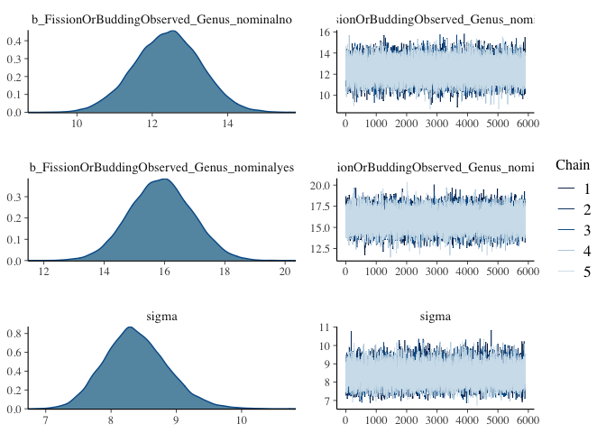<!-- -->

``` r
pp_check(fit_fission_cell_num) #check the predictions
```

    ## Using 10 posterior samples for ppc type 'dens_overlay' by default.

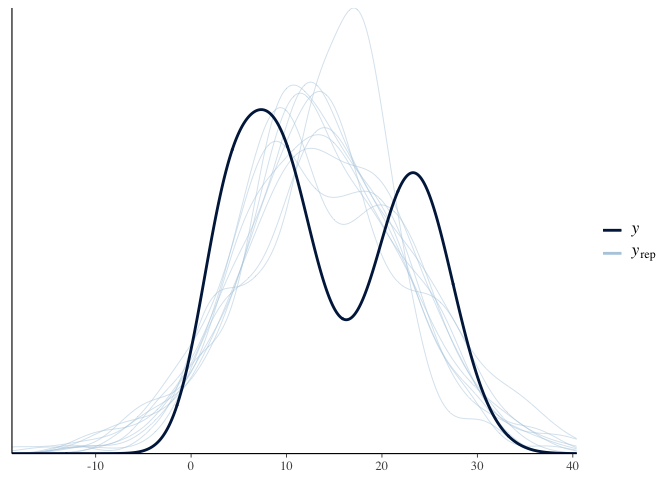<!-- -->

``` r
summary(fit_fission_cell_num) #summary of model 
```

    ##  Family: gaussian 
    ##   Links: mu = identity; sigma = identity 
    ## Formula: log(cell_number) ~ 0 + FissionOrBuddingObserved_Genus_nominal 
    ##    Data: df (Number of observations: 155) 
    ## Samples: 5 chains, each with iter = 6e+06; warmup = 1e+05; thin = 1000;
    ##          total post-warmup samples = 29500
    ## 
    ## Population-Level Effects: 
    ##                                           Estimate Est.Error l-95% CI u-95% CI
    ## FissionOrBuddingObserved_Genus_nominalno     12.41      0.88    10.66    14.11
    ## FissionOrBuddingObserved_Genus_nominalyes    15.88      1.03    13.86    17.89
    ##                                           Rhat Bulk_ESS Tail_ESS
    ## FissionOrBuddingObserved_Genus_nominalno  1.00    29496    29547
    ## FissionOrBuddingObserved_Genus_nominalyes 1.00    29056    28985
    ## 
    ## Family Specific Parameters: 
    ##       Estimate Est.Error l-95% CI u-95% CI Rhat Bulk_ESS Tail_ESS
    ## sigma     8.38      0.48     7.50     9.40 1.00    29919    29801
    ## 
    ## Samples were drawn using sampling(NUTS). For each parameter, Bulk_ESS
    ## and Tail_ESS are effective sample size measures, and Rhat is the potential
    ## scale reduction factor on split chains (at convergence, Rhat = 1).

``` r
posterior_summary(fit_fission_cell_num, robust = T)
```

    ##                                                Estimate Est.Error        Q2.5
    ## b_FissionOrBuddingObserved_Genus_nominalno    12.418883 0.8870628   10.658512
    ## b_FissionOrBuddingObserved_Genus_nominalyes   15.879885 1.0370737   13.863384
    ## sigma                                          8.356744 0.4742410    7.501903
    ## lp__                                        -558.203857 1.0075698 -561.736062
    ##                                                   Q97.5
    ## b_FissionOrBuddingObserved_Genus_nominalno    14.106579
    ## b_FissionOrBuddingObserved_Genus_nominalyes   17.891522
    ## sigma                                          9.403149
    ## lp__                                        -557.106225

``` r
plot(conditional_effects(fit_fission_cell_num, points = TRUE, ask = F)) 
```

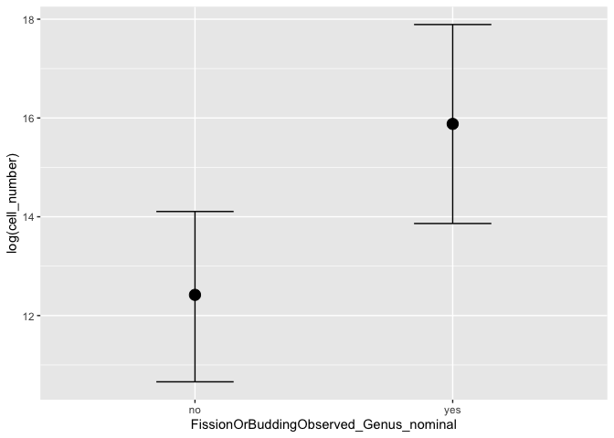<!-- -->

``` r
hyp = hypothesis(fit_fission_cell_num,  "FissionOrBuddingObserved_Genus_nominalno > FissionOrBuddingObserved_Genus_nominalyes") #test hypothesis that there is no difference based on coefficients
hyp
```

    ## Hypothesis Tests for class b:
    ##                 Hypothesis Estimate Est.Error CI.Lower CI.Upper Evid.Ratio
    ## 1 (FissionOrBudding... > 0    -3.47      1.36    -5.72    -1.24       0.01
    ##   Post.Prob Star
    ## 1      0.01     
    ## ---
    ## 'CI': 90%-CI for one-sided and 95%-CI for two-sided hypotheses.
    ## '*': For one-sided hypotheses, the posterior probability exceeds 95%;
    ## for two-sided hypotheses, the value tested against lies outside the 95%-CI.
    ## Posterior probabilities of point hypotheses assume equal prior probabilities.

``` r
plot(hyp)
```

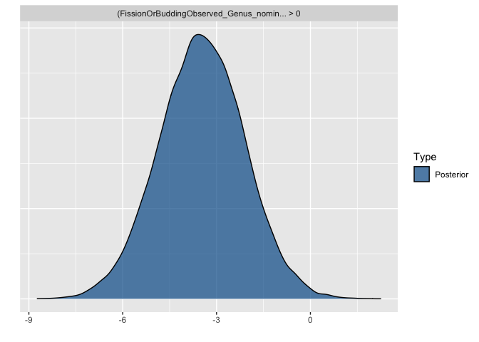<!-- -->

### Does a single-celled bottleneck correlate with increased cell types (per cell)?

``` r
#fit the model 
fit_fission_cell_type<-
  brm(data = df,
      family=poisson(),
      formula = cell_types ~ 0 + FissionOrBuddingObserved_Genus_nominal + scale(log(cell_number)),  #formula, the 0 means that there are estimates for both clonal and non-clonal, rather than relative to each other
      iter = 6000000, warmup = 100000, chains = 5,thin = 1000, cores = 5, #chain settings
      prior = prior(normal(0, 10), "b"), #defining the priors- for things in 'class b' set this prior. (can also use get_priors() and set_priors() fucncitons) 
      file = 'fits/fit_FissionCellType' ) 

plot(fit_fission_cell_type) #check that chains converged
```

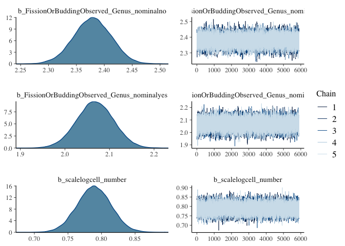<!-- -->

``` r
pp_check(fit_fission_cell_type) #check the predictions
```

    ## Using 10 posterior samples for ppc type 'dens_overlay' by default.

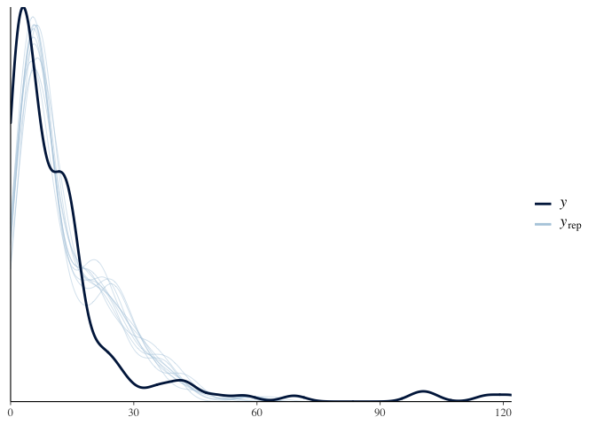<!-- -->

``` r
summary(fit_fission_cell_type) #summary of model 
```

    ##  Family: poisson 
    ##   Links: mu = log 
    ## Formula: cell_types ~ 0 + FissionOrBuddingObserved_Genus_nominal + scale(log(cell_number)) 
    ##    Data: df (Number of observations: 154) 
    ## Samples: 5 chains, each with iter = 6e+06; warmup = 1e+05; thin = 1000;
    ##          total post-warmup samples = 29500
    ## 
    ## Population-Level Effects: 
    ##                                           Estimate Est.Error l-95% CI u-95% CI
    ## FissionOrBuddingObserved_Genus_nominalno      2.38      0.03     2.31     2.44
    ## FissionOrBuddingObserved_Genus_nominalyes     2.07      0.04     1.99     2.15
    ## scalelogcell_number                           0.79      0.03     0.74     0.84
    ##                                           Rhat Bulk_ESS Tail_ESS
    ## FissionOrBuddingObserved_Genus_nominalno  1.00    29863    28122
    ## FissionOrBuddingObserved_Genus_nominalyes 1.00    29051    29217
    ## scalelogcell_number                       1.00    29251    29053
    ## 
    ## Samples were drawn using sampling(NUTS). For each parameter, Bulk_ESS
    ## and Tail_ESS are effective sample size measures, and Rhat is the potential
    ## scale reduction factor on split chains (at convergence, Rhat = 1).

``` r
posterior_summary(fit_fission_cell_type, robust = T)
```

    ##                                                  Estimate  Est.Error
    ## b_FissionOrBuddingObserved_Genus_nominalno      2.3787467 0.03347560
    ## b_FissionOrBuddingObserved_Genus_nominalyes     2.0677443 0.04129789
    ## b_scalelogcell_number                           0.7889378 0.02508357
    ## lp__                                        -1062.9584721 0.98458986
    ##                                                      Q2.5         Q97.5
    ## b_FissionOrBuddingObserved_Genus_nominalno      2.3124781     2.4435956
    ## b_FissionOrBuddingObserved_Genus_nominalyes     1.9861762     2.1479040
    ## b_scalelogcell_number                           0.7397155     0.8380418
    ## lp__                                        -1066.4653841 -1061.8842775

``` r
plot(conditional_effects(fit_fission_cell_type, points = TRUE, ask = F)) 
```

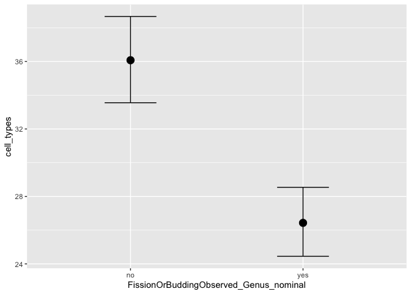<!-- -->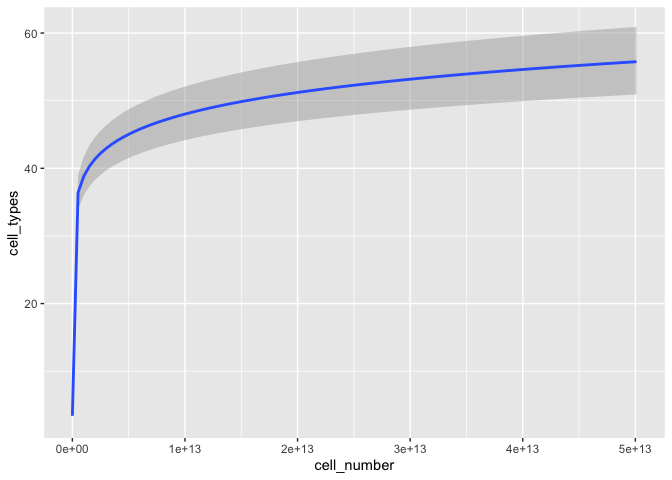<!-- -->

``` r
hyp = hypothesis(fit_fission_cell_type,  "FissionOrBuddingObserved_Genus_nominalno > FissionOrBuddingObserved_Genus_nominalyes") #test hypothesis that there is no difference based on coefficients
hyp
```

    ## Hypothesis Tests for class b:
    ##                 Hypothesis Estimate Est.Error CI.Lower CI.Upper Evid.Ratio
    ## 1 (FissionOrBudding... > 0     0.31      0.05     0.24     0.39        Inf
    ##   Post.Prob Star
    ## 1         1    *
    ## ---
    ## 'CI': 90%-CI for one-sided and 95%-CI for two-sided hypotheses.
    ## '*': For one-sided hypotheses, the posterior probability exceeds 95%;
    ## for two-sided hypotheses, the value tested against lies outside the 95%-CI.
    ## Posterior probabilities of point hypotheses assume equal prior probabilities.

``` r
plot(hyp)
```

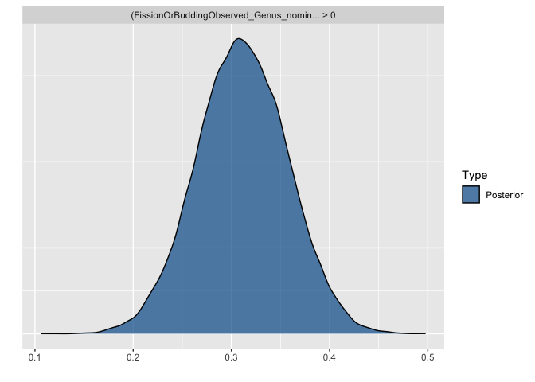<!-- -->
\#\#\# Does germline timing correlate with increased cell
number?

``` r
prior <- get_prior(log(cell_number) ~ 0 + germline_timing_simple, family=gaussian(), data = df) #what priors do we need to define?
```

    ## Warning: Rows containing NAs were excluded from the model.

``` r
#fit the model 
fit_germline_cell_num<-
  brm(data = df,
      family=gaussian(), # family of model
      formula = log(cell_number) ~ 0 + germline_timing_simple,  #formula, the 0 means that there are estimates for both clonal and non-clonal, rather than relative to each other
      iter = 6000000, warmup = 100000, chains = 5,thin = 1000, cores = 5, #chain settings
      prior = prior(normal(0, 10), "b"), #defining the priors- for things in 'class b' set this prior. (can also use get_priors() and set_priors() fucncitons) 
      file = 'fits/fit_GermCellNum' ) 

plot(fit_germline_cell_num) #check that chains converged
```

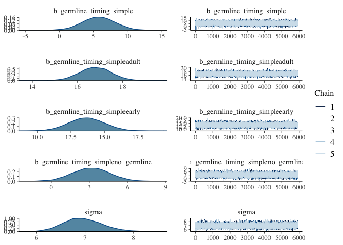<!-- -->

``` r
pp_check(fit_germline_cell_num) #check the predictions
```

    ## Using 10 posterior samples for ppc type 'dens_overlay' by default.

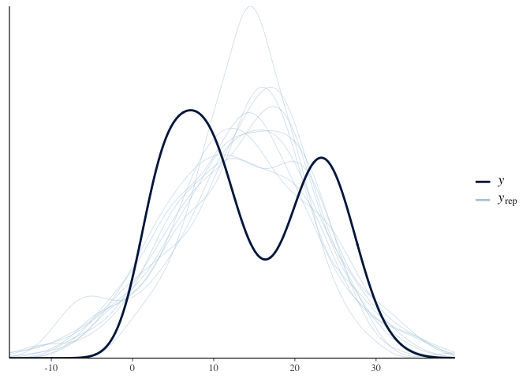<!-- -->

``` r
plot(conditional_effects(fit_germline_cell_num), points = TRUE) 
```

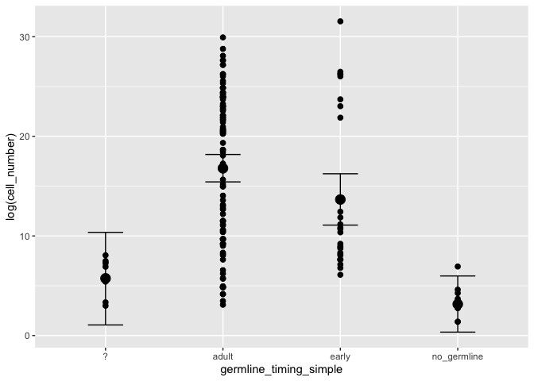<!-- -->

``` r
summary(fit_germline_cell_num)
```

    ##  Family: gaussian 
    ##   Links: mu = identity; sigma = identity 
    ## Formula: log(cell_number) ~ 0 + germline_timing_simple 
    ##    Data: df (Number of observations: 158) 
    ## Samples: 5 chains, each with iter = 6e+06; warmup = 1e+05; thin = 1000;
    ##          total post-warmup samples = 29500
    ## 
    ## Population-Level Effects: 
    ##                                   Estimate Est.Error l-95% CI u-95% CI Rhat
    ## germline_timing_simple                5.75      2.38     1.06    10.36 1.00
    ## germline_timing_simpleadult          16.80      0.70    15.42    18.18 1.00
    ## germline_timing_simpleearly          13.67      1.32    11.09    16.24 1.00
    ## germline_timing_simpleno_germline     3.15      1.45     0.34     5.98 1.00
    ##                                   Bulk_ESS Tail_ESS
    ## germline_timing_simple               29223    28981
    ## germline_timing_simpleadult          28851    27031
    ## germline_timing_simpleearly          28632    28205
    ## germline_timing_simpleno_germline    29223    29179
    ## 
    ## Family Specific Parameters: 
    ##       Estimate Est.Error l-95% CI u-95% CI Rhat Bulk_ESS Tail_ESS
    ## sigma     6.96      0.40     6.23     7.80 1.00    29352    29552
    ## 
    ## Samples were drawn using sampling(NUTS). For each parameter, Bulk_ESS
    ## and Tail_ESS are effective sample size measures, and Rhat is the potential
    ## scale reduction factor on split chains (at convergence, Rhat = 1).

``` r
pairs(fit_germline_cell_num)
```

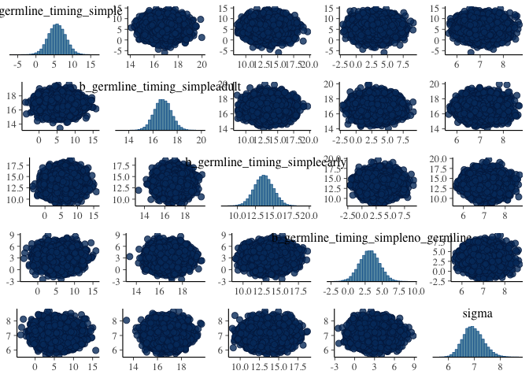<!-- -->

``` r
posterior_summary(fit_germline_cell_num, robust = T) #what are the medians for coefficients? if F, then returns means
```

    ##                                        Estimate Est.Error         Q2.5
    ## b_germline_timing_simple               5.740959 2.3853286    1.0647546
    ## b_germline_timing_simpleadult         16.795643 0.6978221   15.4247193
    ## b_germline_timing_simpleearly         13.658220 1.3175933   11.0893763
    ## b_germline_timing_simpleno_germline    3.150338 1.4499312    0.3424271
    ## sigma                                  6.938587 0.3919637    6.2309749
    ## lp__                                -546.467963 1.4160427 -550.7999339
    ##                                           Q97.5
    ## b_germline_timing_simple              10.358601
    ## b_germline_timing_simpleadult         18.178305
    ## b_germline_timing_simpleearly         16.244379
    ## b_germline_timing_simpleno_germline    5.982424
    ## sigma                                  7.798130
    ## lp__                                -544.704614

### Does germline timing correlate with increased cell types (per cell)?

``` r
fit_type<-
  brm(data = df,
      family=poisson(),
      formula = cell_types ~ 0 + germline_timing_simple + scale(log(cell_number)),
      iter = 6000000, warmup = 100000, chains = 5, thin = 10000, cores = 5,
      prior = prior(normal(0, 10), "b"), file = 'fits/fit_GermCellType')

plot(fit_type) #check that chains converged
```

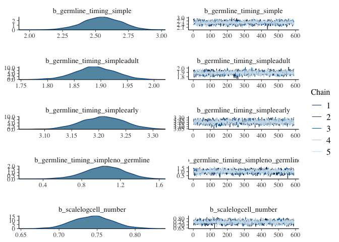<!-- -->

``` r
pp_check(fit_type) #check the predictions
```

    ## Using 10 posterior samples for ppc type 'dens_overlay' by default.

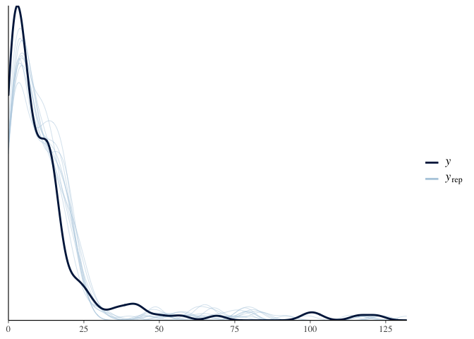<!-- -->

``` r
summary(fit_type) #summary of model 
```

    ##  Family: poisson 
    ##   Links: mu = log 
    ## Formula: cell_types ~ 0 + germline_timing_simple + scale(log(cell_number)) 
    ##    Data: df (Number of observations: 157) 
    ## Samples: 5 chains, each with iter = 6e+06; warmup = 1e+05; thin = 10000;
    ##          total post-warmup samples = 2950
    ## 
    ## Population-Level Effects: 
    ##                                   Estimate Est.Error l-95% CI u-95% CI Rhat
    ## germline_timing_simple                2.55      0.14     2.26     2.82 1.00
    ## germline_timing_simpleadult           1.89      0.04     1.81     1.96 1.00
    ## germline_timing_simpleearly           3.21      0.04     3.13     3.28 1.00
    ## germline_timing_simpleno_germline     1.04      0.20     0.62     1.42 1.00
    ## scalelogcell_number                   0.74      0.03     0.70     0.80 1.00
    ##                                   Bulk_ESS Tail_ESS
    ## germline_timing_simple                2673     2593
    ## germline_timing_simpleadult           2830     2381
    ## germline_timing_simpleearly           2804     2903
    ## germline_timing_simpleno_germline     3223     2797
    ## scalelogcell_number                   2872     2968
    ## 
    ## Samples were drawn using sampling(NUTS). For each parameter, Bulk_ESS
    ## and Tail_ESS are effective sample size measures, and Rhat is the potential
    ## scale reduction factor on split chains (at convergence, Rhat = 1).

``` r
posterior_summary(fit_type, robust = T)
```

    ##                                         Estimate  Est.Error         Q2.5
    ## b_germline_timing_simple               2.5487216 0.14423226    2.2551736
    ## b_germline_timing_simpleadult          1.8894040 0.03775240    1.8144627
    ## b_germline_timing_simpleearly          3.2075050 0.03998024    3.1297714
    ## b_germline_timing_simpleno_germline    1.0396894 0.20202034    0.6211784
    ## b_scalelogcell_number                  0.7445076 0.02645249    0.6956847
    ## lp__                                -691.2963797 1.44798205 -695.5565536
    ##                                            Q97.5
    ## b_germline_timing_simple               2.8158235
    ## b_germline_timing_simpleadult          1.9622219
    ## b_germline_timing_simpleearly          3.2847058
    ## b_germline_timing_simpleno_germline    1.4226097
    ## b_scalelogcell_number                  0.7974566
    ## lp__                                -689.5067283

``` r
plot(conditional_effects(fit_type), points = TRUE, ask = F) 
```

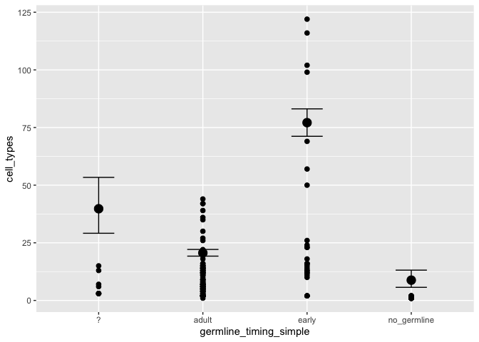<!-- -->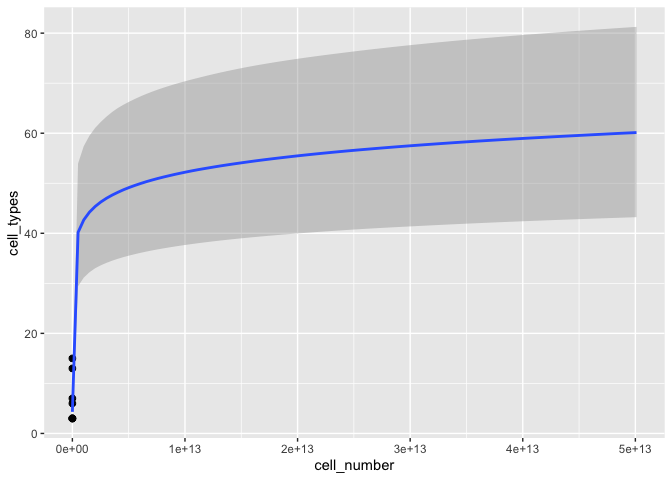<!-- -->

## Phylogenetically informed:

### Does a single-celled bottleneck correlate with increased cell number?

``` r
fit_cellnumber_fission_phy<-
  brm(data = df,
      family=gaussian(), # family of model
      formula = log(cell_number) ~ 0 + FissionOrBuddingObserved_Genus_nominal + (1|gr(species_id, cov = CovarMatrix)),
      iter = 6000000, warmup = 100000, chains = 5, thin = 1000, cores = 5,
      prior = prior(normal(0, 10), "b"), file = 'fits/fit_phy_FissionCellNumber', # same simple prior
      data2 = list(CovarMatrix = CovarMatrix))

plot(fit_cellnumber_fission_phy) #check that chains converged
```

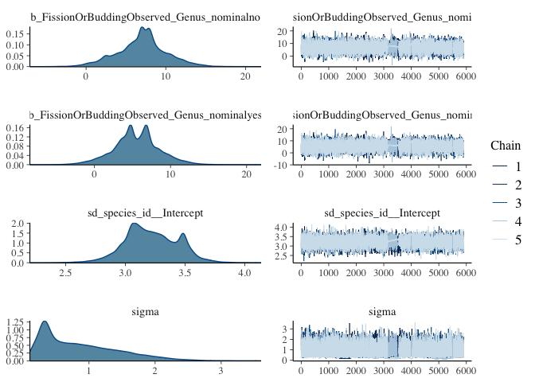<!-- -->

``` r
pp_check(fit_cellnumber_fission_phy) #check the predictions
```

    ## Using 10 posterior samples for ppc type 'dens_overlay' by default.

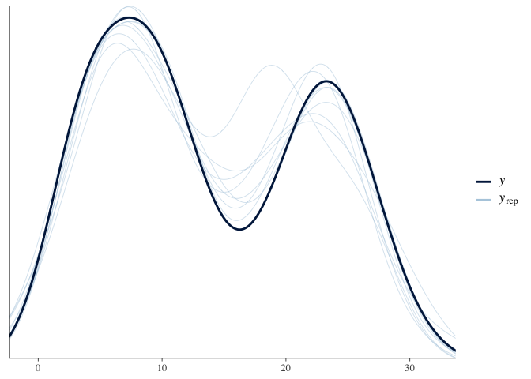<!-- -->

``` r
summary(fit_cellnumber_fission_phy) #summary of model 
```

    ## Warning: Parts of the model have not converged (some Rhats are > 1.05). Be
    ## careful when analysing the results! We recommend running more iterations and/or
    ## setting stronger priors.

    ## Warning: There were 12874 divergent transitions after warmup.
    ## Increasing adapt_delta above 0.8 may help. See http://mc-stan.org/misc/
    ## warnings.html#divergent-transitions-after-warmup

    ##  Family: gaussian 
    ##   Links: mu = identity; sigma = identity 
    ## Formula: log(cell_number) ~ 0 + FissionOrBuddingObserved_Genus_nominal + (1 | gr(species_id, cov = CovarMatrix)) 
    ##    Data: df (Number of observations: 155) 
    ## Samples: 5 chains, each with iter = 6e+06; warmup = 1e+05; thin = 1000;
    ##          total post-warmup samples = 29500
    ## 
    ## Group-Level Effects: 
    ## ~species_id (Number of levels: 155) 
    ##               Estimate Est.Error l-95% CI u-95% CI Rhat Bulk_ESS Tail_ESS
    ## sd(Intercept)     3.22      0.22     2.80     3.63 1.04       76     2143
    ## 
    ## Population-Level Effects: 
    ##                                           Estimate Est.Error l-95% CI u-95% CI
    ## FissionOrBuddingObserved_Genus_nominalno      7.00      3.07     0.62    13.20
    ## FissionOrBuddingObserved_Genus_nominalyes     5.51      2.99    -0.68    11.64
    ##                                           Rhat Bulk_ESS Tail_ESS
    ## FissionOrBuddingObserved_Genus_nominalno  1.06      526     1236
    ## FissionOrBuddingObserved_Genus_nominalyes 1.03      730     1621
    ## 
    ## Family Specific Parameters: 
    ##       Estimate Est.Error l-95% CI u-95% CI Rhat Bulk_ESS Tail_ESS
    ## sigma     0.86      0.57     0.15     2.18 1.03       95       64
    ## 
    ## Samples were drawn using sampling(NUTS). For each parameter, Bulk_ESS
    ## and Tail_ESS are effective sample size measures, and Rhat is the potential
    ## scale reduction factor on split chains (at convergence, Rhat = 1).

``` r
posterior_summary(fit_cellnumber_fission_phy, robust = T)
```

    ##                                                  Estimate   Est.Error
    ## b_FissionOrBuddingObserved_Genus_nominalno     7.06462590   2.5895889
    ## b_FissionOrBuddingObserved_Genus_nominalyes    5.45522328   2.6092922
    ## sd_species_id__Intercept                       3.20384042   0.2264722
    ## sigma                                          0.72089274   0.5919395
    ## r_species_id[ott1002450,Intercept]            -1.85243086   2.8090915
    ## r_species_id[ott1017821,Intercept]            -2.80044951   2.7038441
    ## r_species_id[ott1052546,Intercept]            -2.73875225   2.7642125
    ## r_species_id[ott1059898,Intercept]             4.01304318   2.7785176
    ## r_species_id[ott1059900,Intercept]             5.82412830   2.7165660
    ## r_species_id[ott1061937,Intercept]            -0.14428369   2.6766553
    ## r_species_id[ott1069171,Intercept]            14.48010103   2.7532761
    ## r_species_id[ott1072227,Intercept]            -4.24083957   2.6928973
    ## r_species_id[ott108923,Intercept]              7.71513917   2.6102208
    ## r_species_id[ott1099013,Intercept]            16.80643889   2.6667915
    ## r_species_id[ott111442,Intercept]              5.52938040   2.6811066
    ## r_species_id[ott112015,Intercept]             -4.17709194   2.6744641
    ## r_species_id[ott112016,Intercept]             -4.20107568   2.7372812
    ## r_species_id[ott112017,Intercept]             -4.20765377   2.7074165
    ## r_species_id[ott127047,Intercept]             -0.35580876   2.7180326
    ## r_species_id[ott150272,Intercept]              1.86807718   2.6927313
    ## r_species_id[ott160850,Intercept]              4.39747634   2.7447592
    ## r_species_id[ott165368,Intercept]             18.85790714   2.7583775
    ## r_species_id[ott167121,Intercept]             -3.50129469   2.7580639
    ## r_species_id[ott178177,Intercept]             12.69432336   2.6601421
    ## r_species_id[ott178412,Intercept]             23.66802988   2.9719074
    ## r_species_id[ott181933,Intercept]             20.90184100   2.7906664
    ## r_species_id[ott182906,Intercept]             18.99877082   2.8370405
    ## r_species_id[ott186999,Intercept]             16.99113276   2.7565517
    ## r_species_id[ott187583,Intercept]              1.26693806   2.6848839
    ## r_species_id[ott199292,Intercept]              9.58302637   2.7507597
    ## r_species_id[ott207134,Intercept]             14.86303398   2.7465218
    ## r_species_id[ott215125,Intercept]             18.44067947   2.7236789
    ## r_species_id[ott216694,Intercept]             20.55006858   2.7228557
    ## r_species_id[ott223669,Intercept]             19.12623089   2.6900868
    ## r_species_id[ott225275,Intercept]             15.90837936   2.6453660
    ## r_species_id[ott237608,Intercept]             15.14576471   2.7744054
    ## r_species_id[ott246046,Intercept]              4.10050148   2.8871997
    ## r_species_id[ott247341,Intercept]             24.15825759   2.7530895
    ## r_species_id[ott256062,Intercept]             -2.17294819   2.8040605
    ## r_species_id[ott256089,Intercept]             -3.52491631   2.8130362
    ## r_species_id[ott256145,Intercept]             -2.08522229   2.6759763
    ## r_species_id[ott263960,Intercept]             14.89675567   2.7572527
    ## r_species_id[ott263980,Intercept]             14.88774825   2.7323777
    ## r_species_id[ott263987,Intercept]             11.39585914   2.6754832
    ## r_species_id[ott263988,Intercept]             17.21976655   2.6710946
    ## r_species_id[ott265121,Intercept]             20.27596373   2.7982612
    ## r_species_id[ott266342,Intercept]              0.32072246   2.6698828
    ## r_species_id[ott269063,Intercept]             -2.32046776   2.7214678
    ## r_species_id[ott275893,Intercept]             14.66677246   2.7158486
    ## r_species_id[ott275897,Intercept]             13.43791522   2.8018966
    ## r_species_id[ott2810724,Intercept]            -3.07024715   2.7981436
    ## r_species_id[ott2819986,Intercept]            17.07850384   2.7711695
    ## r_species_id[ott2821097,Intercept]            15.45500911   2.6395185
    ## r_species_id[ott2844172,Intercept]             2.83086212   2.8482366
    ## r_species_id[ott2844962,Intercept]             0.25547343   2.7371942
    ## r_species_id[ott2849837,Intercept]            -0.05825265   2.7480528
    ## r_species_id[ott2942244,Intercept]             4.70885092   2.7197860
    ## r_species_id[ott316441,Intercept]             15.59252344   2.7838582
    ## r_species_id[ott33153,Intercept]              -2.68853508   2.6941110
    ## r_species_id[ott336388,Intercept]             20.17661393   2.7708653
    ## r_species_id[ott34559,Intercept]              15.96944183   2.7292542
    ## r_species_id[ott346740,Intercept]             19.16350509   2.7894092
    ## r_species_id[ott3583594,Intercept]             2.11305880   2.7593074
    ## r_species_id[ott3587677,Intercept]            -0.68530482   2.7407637
    ## r_species_id[ott359012,Intercept]             -4.26750563   2.7914553
    ## r_species_id[ott361837,Intercept]             -2.64190158   2.6623175
    ## r_species_id[ott362913,Intercept]              5.03144730   2.7262401
    ## r_species_id[ott365439,Intercept]              3.27566767   2.6616060
    ## r_species_id[ott3663378,Intercept]            11.54967001   2.7989450
    ## r_species_id[ott3665433,Intercept]             5.69653135   2.7113222
    ## r_species_id[ott3684291,Intercept]             0.22115732   2.6739226
    ## r_species_id[ott3684365,Intercept]             0.30961312   2.6899387
    ## r_species_id[ott3684379,Intercept]            -3.92942596   2.8074330
    ## r_species_id[ott3684389,Intercept]            -1.64064479   2.6989463
    ## r_species_id[ott3684437,Intercept]            -3.57846033   2.8029167
    ## r_species_id[ott381979,Intercept]             -3.89687613   2.7058268
    ## r_species_id[ott381980,Intercept]              3.14747236   2.6965249
    ## r_species_id[ott381983,Intercept]             -4.48010146   2.7381493
    ## r_species_id[ott395048,Intercept]             -0.43657552   2.7761680
    ## r_species_id[ott3974169,Intercept]            17.80063262   2.7558329
    ## r_species_id[ott3995126,Intercept]            18.77244271   2.6970873
    ## r_species_id[ott4010019,Intercept]            16.82535782   2.7518213
    ## r_species_id[ott4010960,Intercept]            19.10451446   2.7397183
    ## r_species_id[ott4011155,Intercept]            10.62806401   2.9390731
    ## r_species_id[ott4013437,Intercept]            16.19825677   2.7242763
    ## r_species_id[ott4013674,Intercept]            20.35575993   2.8604399
    ## r_species_id[ott4013684,Intercept]            19.11799438   2.8062905
    ## r_species_id[ott422679,Intercept]              0.31217461   2.6767994
    ## r_species_id[ott431388,Intercept]              8.32818209   2.6443083
    ## r_species_id[ott446088,Intercept]              3.66570294   2.6914361
    ## r_species_id[ott4741377,Intercept]            15.38966560   2.6838422
    ## r_species_id[ott4742064,Intercept]            20.14242643   2.8238228
    ## r_species_id[ott481952,Intercept]             19.43833164   2.8227131
    ## r_species_id[ott48288,Intercept]              14.85349649   2.7291567
    ## r_species_id[ott485470,Intercept]              0.44638186   2.6846161
    ## r_species_id[ott485473,Intercept]             -2.06078688   2.6968523
    ## r_species_id[ott485476,Intercept]             -3.49008996   2.7191755
    ## r_species_id[ott485480,Intercept]              2.56903733   2.7001135
    ## r_species_id[ott485482,Intercept]              0.26986461   2.7084729
    ## r_species_id[ott486834,Intercept]             -0.74023063   2.7435296
    ## r_species_id[ott490206,Intercept]              6.01146782   2.7661244
    ## r_species_id[ott492241,Intercept]              0.93177169   2.7597267
    ## r_species_id[ott497063,Intercept]             15.07278049   2.7461882
    ## r_species_id[ott4974308,Intercept]             5.88885260   2.8797881
    ## r_species_id[ott4978773,Intercept]             1.16175026   2.7343386
    ## r_species_id[ott4979583,Intercept]             1.83138040   2.7005108
    ## r_species_id[ott518643,Intercept]              3.59204363   2.6888601
    ## r_species_id[ott542509,Intercept]             18.94816328   2.7020345
    ## r_species_id[ott54768,Intercept]               9.59079817   2.7571210
    ## r_species_id[ott549846,Intercept]              7.06127581   2.7288303
    ## r_species_id[ott560703,Intercept]             -1.97294064   2.7702370
    ## r_species_id[ott567703,Intercept]             18.06534720   2.7087620
    ## r_species_id[ott570365,Intercept]              0.60554246   2.7851363
    ## r_species_id[ott570656,Intercept]             12.09267016   2.7319978
    ## r_species_id[ott588761,Intercept]              3.69688440   2.7379335
    ## r_species_id[ott592355,Intercept]             14.97983887   2.7412680
    ## r_species_id[ott601255,Intercept]             23.16553691   2.7210835
    ## r_species_id[ott602180,Intercept]             -0.84721264   2.7104600
    ## r_species_id[ott60470,Intercept]              -2.67504695   2.7610017
    ## r_species_id[ott60473,Intercept]              -2.70017893   2.7153491
    ## r_species_id[ott60479,Intercept]              -3.48652780   2.7023470
    ## r_species_id[ott633708,Intercept]              1.12622173   2.6814608
    ## r_species_id[ott633710,Intercept]              3.15557170   2.7344595
    ## r_species_id[ott633711,Intercept]              1.76278892   2.7059625
    ## r_species_id[ott633717,Intercept]             -2.26409405   2.7441659
    ## r_species_id[ott633719,Intercept]              2.42368014   2.7063111
    ## r_species_id[ott643237,Intercept]             16.69984964   2.7296852
    ## r_species_id[ott645555,Intercept]             19.63684711   2.7968853
    ## r_species_id[ott649193,Intercept]             18.55450035   2.7795635
    ## r_species_id[ott675301,Intercept]              1.11082937   2.7405402
    ## r_species_id[ott724784,Intercept]             10.33238337   2.9094993
    ## r_species_id[ott72522,Intercept]              20.29659929   2.6985701
    ## r_species_id[ott727979,Intercept]             21.71416569   2.8690236
    ## r_species_id[ott733462,Intercept]             16.89958936   2.7111354
    ## r_species_id[ott736728,Intercept]              5.37033166   2.7363974
    ## r_species_id[ott742128,Intercept]              3.56133377   2.6983100
    ## r_species_id[ott7489702,Intercept]             3.80584590   2.7126916
    ## r_species_id[ott7567530,Intercept]             5.49684986   2.7330045
    ## r_species_id[ott765113,Intercept]             -0.52866604   2.7085757
    ## r_species_id[ott765280,Intercept]             13.86883792   2.6744774
    ## r_species_id[ott779028,Intercept]             16.42257505   2.7051891
    ## r_species_id[ott790395,Intercept]             15.99967293   2.6977480
    ## r_species_id[ott817791,Intercept]             14.61663453   2.8390008
    ## r_species_id[ott821356,Intercept]             15.18999811   2.8275455
    ## r_species_id[ott83430,Intercept]              11.33357986   2.6885018
    ## r_species_id[ott83432,Intercept]               5.11148068   2.8690091
    ## r_species_id[ott840001,Intercept]             18.43516581   2.7722402
    ## r_species_id[ott841027,Intercept]              0.29718964   2.7355523
    ## r_species_id[ott849781,Intercept]             13.98145426   2.7217247
    ## r_species_id[ott878345,Intercept]              5.76361294   2.7333749
    ## r_species_id[ott92556,Intercept]              13.10896349   2.7573013
    ## r_species_id[ott92561,Intercept]              14.58847774   2.6771453
    ## r_species_id[ott939432,Intercept]              4.38779929   2.6871800
    ## r_species_id[ott939454,Intercept]              4.42192810   2.6682235
    ## r_species_id[ott954042,Intercept]             16.28009470   2.8028405
    ## r_species_id[ott958293,Intercept]             -3.35840565   2.7726895
    ## r_species_id[ott958304,Intercept]             -4.24099051   2.7461189
    ## r_species_id[ott962359,Intercept]              2.68090529   2.7190010
    ## r_species_id[ott987480,Intercept]              0.19368309   2.7132913
    ## lp__                                        -399.71144620 137.6455875
    ##                                                     Q2.5       Q97.5
    ## b_FissionOrBuddingObserved_Genus_nominalno     0.6153936   13.195213
    ## b_FissionOrBuddingObserved_Genus_nominalyes   -0.6794411   11.638574
    ## sd_species_id__Intercept                       2.8047455    3.630059
    ## sigma                                          0.1534412    2.183785
    ## r_species_id[ott1002450,Intercept]            -8.2535254    4.507410
    ## r_species_id[ott1017821,Intercept]            -9.2129083    3.850850
    ## r_species_id[ott1052546,Intercept]            -9.2473592    3.854425
    ## r_species_id[ott1059898,Intercept]            -2.3087431   10.518682
    ## r_species_id[ott1059900,Intercept]            -0.5831382   12.294295
    ## r_species_id[ott1061937,Intercept]            -6.4365593    6.695234
    ## r_species_id[ott1069171,Intercept]             7.8528621   20.883961
    ## r_species_id[ott1072227,Intercept]           -10.6696703    2.511261
    ## r_species_id[ott108923,Intercept]              1.3654064   14.159741
    ## r_species_id[ott1099013,Intercept]            10.2768144   23.359566
    ## r_species_id[ott111442,Intercept]             -0.9207088   11.972166
    ## r_species_id[ott112015,Intercept]            -10.6606933    2.386327
    ## r_species_id[ott112016,Intercept]            -10.6022482    2.363083
    ## r_species_id[ott112017,Intercept]            -10.6540915    2.398650
    ## r_species_id[ott127047,Intercept]             -6.5244252    6.450267
    ## r_species_id[ott150272,Intercept]             -4.6891239    8.410393
    ## r_species_id[ott160850,Intercept]             -2.1814263   10.927224
    ## r_species_id[ott165368,Intercept]             12.6696491   25.828349
    ## r_species_id[ott167121,Intercept]             -9.8557888    3.145288
    ## r_species_id[ott178177,Intercept]              6.4304450   19.300072
    ## r_species_id[ott178412,Intercept]             16.4810238   30.084451
    ## r_species_id[ott181933,Intercept]             14.4299745   27.617541
    ## r_species_id[ott182906,Intercept]             12.1287514   25.699551
    ## r_species_id[ott186999,Intercept]             10.5078434   23.372559
    ## r_species_id[ott187583,Intercept]             -5.2000029    7.937452
    ## r_species_id[ott199292,Intercept]              3.1507855   16.023225
    ## r_species_id[ott207134,Intercept]              8.2895121   21.492542
    ## r_species_id[ott215125,Intercept]             12.0046116   24.849939
    ## r_species_id[ott216694,Intercept]             14.0932150   27.172168
    ## r_species_id[ott223669,Intercept]             12.5827142   25.795217
    ## r_species_id[ott225275,Intercept]              9.4446519   22.573019
    ## r_species_id[ott237608,Intercept]              8.4970227   21.482666
    ## r_species_id[ott246046,Intercept]             -2.3948808   10.454370
    ## r_species_id[ott247341,Intercept]             17.3672435   30.799265
    ## r_species_id[ott256062,Intercept]             -8.5688555    4.555120
    ## r_species_id[ott256089,Intercept]             -9.6511326    3.491819
    ## r_species_id[ott256145,Intercept]             -8.5432216    4.306427
    ## r_species_id[ott263960,Intercept]              8.3898498   21.332512
    ## r_species_id[ott263980,Intercept]              8.3715337   21.307315
    ## r_species_id[ott263987,Intercept]              4.9957440   17.854514
    ## r_species_id[ott263988,Intercept]             10.6184854   23.805139
    ## r_species_id[ott265121,Intercept]             13.5209187   26.770808
    ## r_species_id[ott266342,Intercept]             -5.8356101    7.291808
    ## r_species_id[ott269063,Intercept]             -8.7328513    4.116569
    ## r_species_id[ott275893,Intercept]              8.1221434   21.042547
    ## r_species_id[ott275897,Intercept]              6.9637121   20.058729
    ## r_species_id[ott2810724,Intercept]            -9.0700272    4.110758
    ## r_species_id[ott2819986,Intercept]            10.5575491   23.722539
    ## r_species_id[ott2821097,Intercept]             9.2464122   22.282312
    ## r_species_id[ott2844172,Intercept]            -3.5657695    9.224794
    ## r_species_id[ott2844962,Intercept]            -6.1645262    6.854245
    ## r_species_id[ott2849837,Intercept]            -6.2970802    6.858210
    ## r_species_id[ott2942244,Intercept]            -1.7905999   11.357933
    ## r_species_id[ott316441,Intercept]              8.7586729   22.280565
    ## r_species_id[ott33153,Intercept]              -9.1698201    3.965317
    ## r_species_id[ott336388,Intercept]             13.5516126   26.778124
    ## r_species_id[ott34559,Intercept]               9.3806520   22.584391
    ## r_species_id[ott346740,Intercept]             12.6480426   25.411975
    ## r_species_id[ott3583594,Intercept]            -4.2737786    8.854982
    ## r_species_id[ott3587677,Intercept]            -7.1759664    5.840956
    ## r_species_id[ott359012,Intercept]            -10.5232298    2.467659
    ## r_species_id[ott361837,Intercept]             -9.0906803    3.689092
    ## r_species_id[ott362913,Intercept]             -1.4602325   11.359886
    ## r_species_id[ott365439,Intercept]             -2.8674215   10.093817
    ## r_species_id[ott3663378,Intercept]             4.9880248   18.179411
    ## r_species_id[ott3665433,Intercept]            -0.8267493   12.380952
    ## r_species_id[ott3684291,Intercept]            -6.2346401    6.833449
    ## r_species_id[ott3684365,Intercept]            -6.2959529    6.872882
    ## r_species_id[ott3684379,Intercept]           -10.3242629    2.722197
    ## r_species_id[ott3684389,Intercept]            -8.1871576    4.936396
    ## r_species_id[ott3684437,Intercept]            -9.9204912    3.142227
    ## r_species_id[ott381979,Intercept]            -10.3520114    2.561869
    ## r_species_id[ott381980,Intercept]             -3.5255402    9.680731
    ## r_species_id[ott381983,Intercept]            -10.7514549    2.465423
    ## r_species_id[ott395048,Intercept]             -6.5306492    6.616935
    ## r_species_id[ott3974169,Intercept]            11.3670921   24.284927
    ## r_species_id[ott3995126,Intercept]            12.2511308   25.194752
    ## r_species_id[ott4010019,Intercept]            10.5800765   23.760267
    ## r_species_id[ott4010960,Intercept]            12.5779476   25.446885
    ## r_species_id[ott4011155,Intercept]             4.3694689   17.244428
    ## r_species_id[ott4013437,Intercept]             9.7964007   22.604851
    ## r_species_id[ott4013674,Intercept]            13.7536902   26.748760
    ## r_species_id[ott4013684,Intercept]            12.5436223   25.407325
    ## r_species_id[ott422679,Intercept]             -6.0433408    6.705244
    ## r_species_id[ott431388,Intercept]              1.8792033   14.800622
    ## r_species_id[ott446088,Intercept]             -2.7957409   10.121815
    ## r_species_id[ott4741377,Intercept]             8.9221781   21.722311
    ## r_species_id[ott4742064,Intercept]            13.5650631   26.515198
    ## r_species_id[ott481952,Intercept]             12.7069011   25.874878
    ## r_species_id[ott48288,Intercept]               8.2484201   21.429629
    ## r_species_id[ott485470,Intercept]             -5.9854746    7.246224
    ## r_species_id[ott485473,Intercept]             -8.5832512    4.606154
    ## r_species_id[ott485476,Intercept]             -9.8571933    3.199908
    ## r_species_id[ott485480,Intercept]             -3.9950507    9.210695
    ## r_species_id[ott485482,Intercept]             -5.8149346    7.240549
    ## r_species_id[ott486834,Intercept]             -7.1633583    5.949320
    ## r_species_id[ott490206,Intercept]             -0.5466732   12.553794
    ## r_species_id[ott492241,Intercept]             -5.2772837    7.837014
    ## r_species_id[ott497063,Intercept]              8.6915411   21.693613
    ## r_species_id[ott4974308,Intercept]            -0.4828801   12.412550
    ## r_species_id[ott4978773,Intercept]            -5.1480894    7.891810
    ## r_species_id[ott4979583,Intercept]            -4.5609448    8.490329
    ## r_species_id[ott518643,Intercept]             -2.8578090   10.251227
    ## r_species_id[ott542509,Intercept]             12.6055087   25.650458
    ## r_species_id[ott54768,Intercept]               3.0906864   15.982108
    ## r_species_id[ott549846,Intercept]              0.6143222   13.447608
    ## r_species_id[ott560703,Intercept]             -8.3359703    4.813498
    ## r_species_id[ott567703,Intercept]             11.5668594   24.353932
    ## r_species_id[ott570365,Intercept]             -5.7910680    7.145330
    ## r_species_id[ott570656,Intercept]              5.6397451   18.552881
    ## r_species_id[ott588761,Intercept]             -2.7524379   10.092405
    ## r_species_id[ott592355,Intercept]              8.4001517   21.246589
    ## r_species_id[ott601255,Intercept]             16.6179137   29.604265
    ## r_species_id[ott602180,Intercept]             -7.2758515    5.577403
    ## r_species_id[ott60470,Intercept]              -9.1525329    3.786283
    ## r_species_id[ott60473,Intercept]              -9.1425320    3.715511
    ## r_species_id[ott60479,Intercept]              -9.8946869    3.060752
    ## r_species_id[ott633708,Intercept]             -5.4465843    7.770535
    ## r_species_id[ott633710,Intercept]             -3.5359003    9.750626
    ## r_species_id[ott633711,Intercept]             -4.6078295    8.527661
    ## r_species_id[ott633717,Intercept]             -8.6960403    4.483246
    ## r_species_id[ott633719,Intercept]             -4.0054521    9.106923
    ## r_species_id[ott643237,Intercept]             10.5442387   23.569382
    ## r_species_id[ott645555,Intercept]             13.0318503   26.048557
    ## r_species_id[ott649193,Intercept]             12.0564825   24.905895
    ## r_species_id[ott675301,Intercept]             -5.3667912    7.687026
    ## r_species_id[ott724784,Intercept]              3.9919737   16.818289
    ## r_species_id[ott72522,Intercept]              13.5598568   26.889265
    ## r_species_id[ott727979,Intercept]             15.2729611   28.061368
    ## r_species_id[ott733462,Intercept]             10.3682289   23.292054
    ## r_species_id[ott736728,Intercept]             -0.6671030   12.526205
    ## r_species_id[ott742128,Intercept]             -2.9410691    9.921909
    ## r_species_id[ott7489702,Intercept]            -2.3130235   10.817222
    ## r_species_id[ott7567530,Intercept]            -0.9381590   11.964005
    ## r_species_id[ott765113,Intercept]             -6.6718029    6.330556
    ## r_species_id[ott765280,Intercept]              7.3496208   20.316973
    ## r_species_id[ott779028,Intercept]              9.9072820   22.780252
    ## r_species_id[ott790395,Intercept]              9.5008236   22.492745
    ## r_species_id[ott817791,Intercept]              8.1044548   21.230039
    ## r_species_id[ott821356,Intercept]              8.6940649   21.516381
    ## r_species_id[ott83430,Intercept]               5.3467771   18.370723
    ## r_species_id[ott83432,Intercept]              -1.2166550   12.070073
    ## r_species_id[ott840001,Intercept]             11.8687001   24.716835
    ## r_species_id[ott841027,Intercept]             -5.9138623    7.292688
    ## r_species_id[ott849781,Intercept]              7.7855769   20.916326
    ## r_species_id[ott878345,Intercept]             -0.2970872   12.864811
    ## r_species_id[ott92556,Intercept]               6.5514766   19.478697
    ## r_species_id[ott92561,Intercept]               8.0554953   21.276904
    ## r_species_id[ott939432,Intercept]             -2.0418734   10.982796
    ## r_species_id[ott939454,Intercept]             -2.0257961   10.953848
    ## r_species_id[ott954042,Intercept]              9.4738346   22.910687
    ## r_species_id[ott958293,Intercept]             -9.7746836    3.248121
    ## r_species_id[ott958304,Intercept]            -10.6755199    2.547868
    ## r_species_id[ott962359,Intercept]             -3.8244462    9.103583
    ## r_species_id[ott987480,Intercept]             -5.9046678    7.219286
    ## lp__                                        -571.1418682 -175.711027

``` r
plot(conditional_effects(fit_cellnumber_fission_phy, points = TRUE, ask = F)) 
```

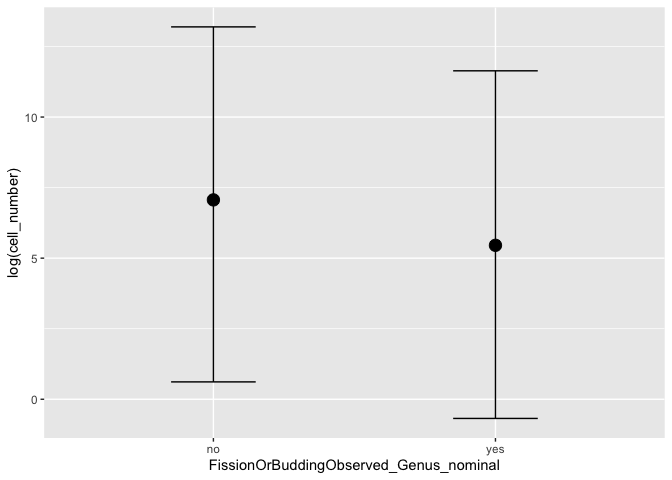<!-- -->

``` r
hyp = hypothesis(fit_cellnumber_fission_phy,  "FissionOrBuddingObserved_Genus_nominalno > FissionOrBuddingObserved_Genus_nominalyes") #test hypothesis that there is no difference based on coefficients
hyp
```

    ## Hypothesis Tests for class b:
    ##                 Hypothesis Estimate Est.Error CI.Lower CI.Upper Evid.Ratio
    ## 1 (FissionOrBudding... > 0     1.48      0.95    -0.13     2.98      15.82
    ##   Post.Prob Star
    ## 1      0.94     
    ## ---
    ## 'CI': 90%-CI for one-sided and 95%-CI for two-sided hypotheses.
    ## '*': For one-sided hypotheses, the posterior probability exceeds 95%;
    ## for two-sided hypotheses, the value tested against lies outside the 95%-CI.
    ## Posterior probabilities of point hypotheses assume equal prior probabilities.

``` r
plot(hyp)
```

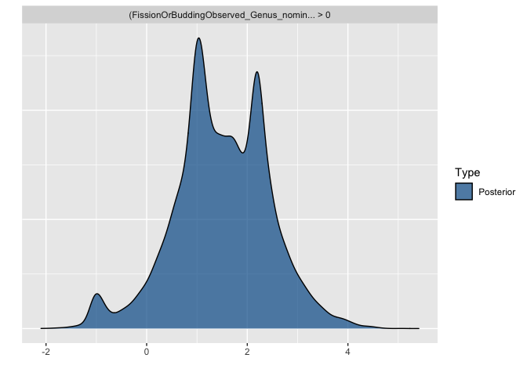<!-- -->
\#\#\# Does a single-celled bottleneck correlate with increased cell
types (per cell)?

``` r
#fit the model 
phylo_fit_fission_cell_type<-
  brm(data = df,
      family=poisson(),
      formula = cell_types ~ 0 + FissionOrBuddingObserved_Genus_nominal + scale(log(cell_number)) + (1|gr(species_id, cov = CovarMatrix)),  #formula, the 0 means that there are estimates for both clonal and non-clonal, rather than relative to each other
      iter = 600000, warmup = 10000, chains = 5,thin = 100, cores = 5, #chain settings
      prior = prior(normal(0, 10), "b"), #defining the priors- for things in 'class b' set this prior. (can also use get_priors() and set_priors() fucncitons)
      data2 = list(CovarMatrix = CovarMatrix),
      file = 'fits/fit_phy_FissionCellType') 

plot(phylo_fit_fission_cell_type) #check that chains converged
```

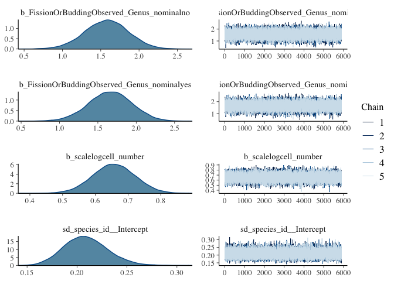<!-- -->

``` r
pp_check(phylo_fit_fission_cell_type) #check the predictions
```

    ## Using 10 posterior samples for ppc type 'dens_overlay' by default.

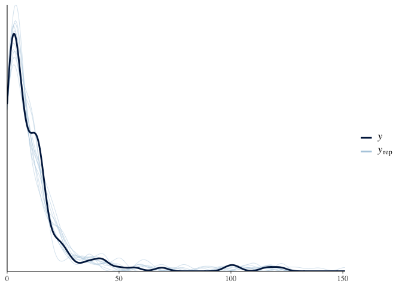<!-- -->

``` r
summary(phylo_fit_fission_cell_type) #summary of model 
```

    ##  Family: poisson 
    ##   Links: mu = log 
    ## Formula: cell_types ~ 0 + FissionOrBuddingObserved_Genus_nominal + scale(log(cell_number)) + (1 | gr(species_id, cov = CovarMatrix)) 
    ##    Data: df (Number of observations: 154) 
    ## Samples: 5 chains, each with iter = 6e+05; warmup = 10000; thin = 100;
    ##          total post-warmup samples = 29500
    ## 
    ## Group-Level Effects: 
    ## ~species_id (Number of levels: 154) 
    ##               Estimate Est.Error l-95% CI u-95% CI Rhat Bulk_ESS Tail_ESS
    ## sd(Intercept)     0.21      0.02     0.17     0.25 1.00    28860    28825
    ## 
    ## Population-Level Effects: 
    ##                                           Estimate Est.Error l-95% CI u-95% CI
    ## FissionOrBuddingObserved_Genus_nominalno      1.58      0.29     1.01     2.13
    ## FissionOrBuddingObserved_Genus_nominalyes     1.66      0.28     1.10     2.21
    ## scalelogcell_number                           0.66      0.07     0.53     0.78
    ##                                           Rhat Bulk_ESS Tail_ESS
    ## FissionOrBuddingObserved_Genus_nominalno  1.00    29830    28977
    ## FissionOrBuddingObserved_Genus_nominalyes 1.00    29526    29464
    ## scalelogcell_number                       1.00    29588    28713
    ## 
    ## Samples were drawn using sampling(NUTS). For each parameter, Bulk_ESS
    ## and Tail_ESS are effective sample size measures, and Rhat is the potential
    ## scale reduction factor on split chains (at convergence, Rhat = 1).

``` r
posterior_summary(phylo_fit_fission_cell_type, robust = T)
```

    ##                                                  Estimate   Est.Error
    ## b_FissionOrBuddingObserved_Genus_nominalno     1.57975901  0.28431764
    ## b_FissionOrBuddingObserved_Genus_nominalyes    1.66406774  0.28292158
    ## b_scalelogcell_number                          0.65641396  0.06464607
    ## sd_species_id__Intercept                       0.20796192  0.02185879
    ## r_species_id[ott1017821,Intercept]            -0.13872134  0.41541290
    ## r_species_id[ott1052546,Intercept]            -0.14202203  0.41569741
    ## r_species_id[ott1059898,Intercept]             0.67425543  0.37103178
    ## r_species_id[ott1059900,Intercept]             0.70214142  0.36523915
    ## r_species_id[ott1061937,Intercept]            -0.47558323  0.44852263
    ## r_species_id[ott1069171,Intercept]             0.61846065  0.34245288
    ## r_species_id[ott1072227,Intercept]            -0.51889050  0.42036713
    ## r_species_id[ott108923,Intercept]              0.75828047  0.35893339
    ## r_species_id[ott1099013,Intercept]            -0.37700487  0.35691566
    ## r_species_id[ott111442,Intercept]              0.99426510  0.35452663
    ## r_species_id[ott112015,Intercept]             -0.53998180  0.41456195
    ## r_species_id[ott112016,Intercept]             -0.53559528  0.41585806
    ## r_species_id[ott112017,Intercept]             -0.54191515  0.41019696
    ## r_species_id[ott127047,Intercept]              0.73698935  0.37072093
    ## r_species_id[ott150272,Intercept]              1.59267695  0.34025351
    ## r_species_id[ott160850,Intercept]             -0.23383634  0.41276043
    ## r_species_id[ott165368,Intercept]              2.18739929  0.31785001
    ## r_species_id[ott167121,Intercept]             -0.50458318  0.38241009
    ## r_species_id[ott178177,Intercept]              0.13150681  0.36757026
    ## r_species_id[ott178412,Intercept]              0.44073731  0.34472506
    ## r_species_id[ott181933,Intercept]             -0.28722482  0.37756923
    ## r_species_id[ott182906,Intercept]              1.66822858  0.32320394
    ## r_species_id[ott186999,Intercept]              0.39693149  0.34835372
    ## r_species_id[ott187583,Intercept]             -0.47546266  0.43292294
    ## r_species_id[ott199292,Intercept]              0.82750605  0.34826390
    ## r_species_id[ott207134,Intercept]             -0.07822147  0.35192665
    ## r_species_id[ott215125,Intercept]              1.29486067  0.32792082
    ## r_species_id[ott216694,Intercept]             -0.76164058  0.38449147
    ## r_species_id[ott223669,Intercept]              2.23114723  0.32006376
    ## r_species_id[ott225275,Intercept]              0.97837550  0.34025223
    ## r_species_id[ott237608,Intercept]             -0.12069755  0.37577865
    ## r_species_id[ott246046,Intercept]              0.25976071  0.37444646
    ## r_species_id[ott247341,Intercept]              1.68170907  0.33499597
    ## r_species_id[ott256062,Intercept]             -0.41285268  0.43137718
    ## r_species_id[ott256089,Intercept]             -0.45039038  0.38337019
    ## r_species_id[ott256145,Intercept]             -0.56779494  0.41047939
    ## r_species_id[ott263960,Intercept]              0.85936455  0.33689830
    ## r_species_id[ott263980,Intercept]             -0.54663204  0.40019610
    ## r_species_id[ott263987,Intercept]             -0.39599285  0.39271247
    ## r_species_id[ott263988,Intercept]             -0.42067572  0.35497117
    ## r_species_id[ott265121,Intercept]             -0.51478646  0.36474281
    ## r_species_id[ott266342,Intercept]             -0.46656434  0.45433284
    ## r_species_id[ott269063,Intercept]             -0.20507072  0.46026227
    ## r_species_id[ott275893,Intercept]             -0.12956579  0.36874931
    ## r_species_id[ott275897,Intercept]             -0.07735847  0.37338734
    ## r_species_id[ott2810724,Intercept]            -0.20705787  0.38189415
    ## r_species_id[ott2819986,Intercept]            -0.46214667  0.38472875
    ## r_species_id[ott2821097,Intercept]            -0.32689895  0.35898502
    ## r_species_id[ott2844172,Intercept]             1.39569918  0.34114349
    ## r_species_id[ott2844962,Intercept]             1.56883984  0.34393042
    ## r_species_id[ott2849837,Intercept]             1.19147645  0.35662687
    ## r_species_id[ott2942244,Intercept]             1.35506835  0.34282721
    ## r_species_id[ott316441,Intercept]              1.62353900  0.32423215
    ## r_species_id[ott33153,Intercept]              -0.35349988  0.39274277
    ## r_species_id[ott336388,Intercept]             -0.47922532  0.37718759
    ## r_species_id[ott34559,Intercept]              -0.42707040  0.37534701
    ## r_species_id[ott346740,Intercept]              0.82709450  0.34050393
    ## r_species_id[ott3583594,Intercept]             1.66052155  0.33289230
    ## r_species_id[ott3587677,Intercept]             2.03318476  0.33695204
    ## r_species_id[ott359012,Intercept]             -0.38009492  0.45261320
    ## r_species_id[ott361837,Intercept]             -0.56129288  0.41243900
    ## r_species_id[ott362913,Intercept]              1.16827850  0.34511698
    ## r_species_id[ott365439,Intercept]              1.09834027  0.34909657
    ## r_species_id[ott3663378,Intercept]             0.75893590  0.34125854
    ## r_species_id[ott3665433,Intercept]             1.12387845  0.34320195
    ## r_species_id[ott3684291,Intercept]             0.48095196  0.36815398
    ## r_species_id[ott3684365,Intercept]             0.40528632  0.38940367
    ## r_species_id[ott3684379,Intercept]             0.59824051  0.39931153
    ## r_species_id[ott3684389,Intercept]             0.45819897  0.39532629
    ## r_species_id[ott3684437,Intercept]             0.47846137  0.38283868
    ## r_species_id[ott381979,Intercept]             -0.19405605  0.42198491
    ## r_species_id[ott381980,Intercept]             -0.48817869  0.37758777
    ## r_species_id[ott381983,Intercept]             -0.54190306  0.41251841
    ## r_species_id[ott395048,Intercept]              2.03160819  0.33225892
    ## r_species_id[ott3974169,Intercept]             1.16207700  0.33105235
    ## r_species_id[ott3995126,Intercept]             1.13136361  0.33115396
    ## r_species_id[ott4010019,Intercept]             0.06435637  0.34144404
    ## r_species_id[ott4010960,Intercept]             0.04211998  0.34661080
    ## r_species_id[ott4011155,Intercept]             0.23198067  0.34823376
    ## r_species_id[ott4013437,Intercept]             0.12690313  0.34562869
    ## r_species_id[ott4013674,Intercept]            -0.04679345  0.34572949
    ## r_species_id[ott4013684,Intercept]             0.01571915  0.34514500
    ## r_species_id[ott422679,Intercept]             -0.11248820  0.35550948
    ## r_species_id[ott431388,Intercept]              1.07355369  0.34666622
    ## r_species_id[ott446088,Intercept]              1.64480245  0.33427166
    ## r_species_id[ott4741377,Intercept]             0.09043462  0.34527037
    ## r_species_id[ott4742064,Intercept]             0.04106179  0.34469417
    ## r_species_id[ott481952,Intercept]              1.12896534  0.33378778
    ## r_species_id[ott48288,Intercept]               1.69545967  0.32308424
    ## r_species_id[ott485470,Intercept]             -0.46987688  0.38023215
    ## r_species_id[ott485473,Intercept]             -0.41487351  0.43365142
    ## r_species_id[ott485476,Intercept]             -0.49827624  0.38018694
    ## r_species_id[ott485480,Intercept]             -0.49558120  0.44330725
    ## r_species_id[ott485482,Intercept]             -0.46853051  0.42576378
    ## r_species_id[ott486834,Intercept]             -0.15409530  0.40042462
    ## r_species_id[ott490206,Intercept]              1.16390159  0.34553784
    ## r_species_id[ott492241,Intercept]              1.39004854  0.35131150
    ## r_species_id[ott497063,Intercept]             -0.41083807  0.37993582
    ## r_species_id[ott4974308,Intercept]             1.23090854  0.33973088
    ## r_species_id[ott4978773,Intercept]             1.49034711  0.34912135
    ## r_species_id[ott4979583,Intercept]             1.42159116  0.34695325
    ## r_species_id[ott518643,Intercept]              1.22792497  0.34648331
    ## r_species_id[ott542509,Intercept]              2.04985414  0.32089922
    ## r_species_id[ott54768,Intercept]               0.77172239  0.35318013
    ## r_species_id[ott549846,Intercept]              1.08119581  0.34246706
    ## r_species_id[ott560703,Intercept]             -0.03236044  0.40138249
    ## r_species_id[ott567703,Intercept]              0.04659771  0.34692188
    ## r_species_id[ott570365,Intercept]              0.74975762  0.36185658
    ## r_species_id[ott570656,Intercept]              0.91996686  0.34283062
    ## r_species_id[ott588761,Intercept]              1.08196305  0.34521115
    ## r_species_id[ott592355,Intercept]              0.44839413  0.34915002
    ## r_species_id[ott601255,Intercept]             -0.81462935  0.39243299
    ## r_species_id[ott602180,Intercept]             -0.22288764  0.43124467
    ## r_species_id[ott60470,Intercept]              -0.56174080  0.40965967
    ## r_species_id[ott60473,Intercept]              -0.56557852  0.40982512
    ## r_species_id[ott60479,Intercept]              -0.50282785  0.38604557
    ## r_species_id[ott633708,Intercept]             -0.44212085  0.42819965
    ## r_species_id[ott633710,Intercept]             -0.48970492  0.37870794
    ## r_species_id[ott633711,Intercept]             -0.48537809  0.42283802
    ## r_species_id[ott633717,Intercept]             -0.39292927  0.44890892
    ## r_species_id[ott633719,Intercept]             -0.48644088  0.37789982
    ## r_species_id[ott643237,Intercept]              1.26818632  0.33213476
    ## r_species_id[ott645555,Intercept]             -0.21718373  0.35162902
    ## r_species_id[ott649193,Intercept]             -0.71636829  0.38442834
    ## r_species_id[ott675301,Intercept]              1.41127832  0.34711307
    ## r_species_id[ott724784,Intercept]              0.03742364  0.35216406
    ## r_species_id[ott72522,Intercept]              -0.21945725  0.36677039
    ## r_species_id[ott727979,Intercept]             -0.81528057  0.39346925
    ## r_species_id[ott733462,Intercept]              0.28410783  0.35811379
    ## r_species_id[ott736728,Intercept]             -0.06721470  0.38997597
    ## r_species_id[ott742128,Intercept]              0.86945655  0.33446909
    ## r_species_id[ott7489702,Intercept]             1.18302434  0.34464639
    ## r_species_id[ott7567530,Intercept]             0.72430636  0.36166701
    ## r_species_id[ott765113,Intercept]             -0.06712116  0.34775022
    ## r_species_id[ott765280,Intercept]              0.81370689  0.34577741
    ## r_species_id[ott779028,Intercept]             -0.05734221  0.34810196
    ## r_species_id[ott790395,Intercept]             -0.42964802  0.35996587
    ## r_species_id[ott817791,Intercept]             -0.29268480  0.37381063
    ## r_species_id[ott821356,Intercept]              0.95375638  0.34054801
    ## r_species_id[ott83430,Intercept]              -0.35884674  0.36199917
    ## r_species_id[ott83432,Intercept]              -0.35272549  0.36736051
    ## r_species_id[ott840001,Intercept]              1.23731547  0.33084455
    ## r_species_id[ott841027,Intercept]             -0.46750432  0.45575787
    ## r_species_id[ott849781,Intercept]             -0.51165616  0.39809053
    ## r_species_id[ott878345,Intercept]             -0.37856252  0.40304440
    ## r_species_id[ott92556,Intercept]              -0.14494907  0.35935992
    ## r_species_id[ott92561,Intercept]              -0.21714118  0.35535410
    ## r_species_id[ott939432,Intercept]             -0.37858169  0.36441454
    ## r_species_id[ott939454,Intercept]             -0.37802167  0.36456947
    ## r_species_id[ott954042,Intercept]              1.02797506  0.33289498
    ## r_species_id[ott958293,Intercept]             -0.47816028  0.40733579
    ## r_species_id[ott958304,Intercept]             -0.51724078  0.41792039
    ## r_species_id[ott962359,Intercept]             -0.25665223  0.41490378
    ## r_species_id[ott987480,Intercept]              1.47650113  0.34884478
    ## lp__                                        -576.07869834 10.96028520
    ##                                                      Q2.5         Q97.5
    ## b_FissionOrBuddingObserved_Genus_nominalno     1.00593684    2.12811496
    ## b_FissionOrBuddingObserved_Genus_nominalyes    1.09656422    2.20766975
    ## b_scalelogcell_number                          0.52941160    0.78328728
    ## sd_species_id__Intercept                       0.16896334    0.25484987
    ## r_species_id[ott1017821,Intercept]            -0.96491904    0.66523797
    ## r_species_id[ott1052546,Intercept]            -0.96401149    0.66054614
    ## r_species_id[ott1059898,Intercept]            -0.07057473    1.39496130
    ## r_species_id[ott1059900,Intercept]            -0.02353618    1.41131097
    ## r_species_id[ott1061937,Intercept]            -1.36512534    0.39870404
    ## r_species_id[ott1069171,Intercept]            -0.06208589    1.30017600
    ## r_species_id[ott1072227,Intercept]            -1.36770676    0.29679213
    ## r_species_id[ott108923,Intercept]              0.06193942    1.46428249
    ## r_species_id[ott1099013,Intercept]            -1.08219914    0.34952338
    ## r_species_id[ott111442,Intercept]              0.29624853    1.71099006
    ## r_species_id[ott112015,Intercept]             -1.36447074    0.28110670
    ## r_species_id[ott112016,Intercept]             -1.36275516    0.27851928
    ## r_species_id[ott112017,Intercept]             -1.36269247    0.27002006
    ## r_species_id[ott127047,Intercept]             -0.00374193    1.47065231
    ## r_species_id[ott150272,Intercept]              0.91961341    2.27592157
    ## r_species_id[ott160850,Intercept]             -1.06589350    0.55791183
    ## r_species_id[ott165368,Intercept]              1.57585410    2.83028604
    ## r_species_id[ott167121,Intercept]             -1.25889761    0.26203828
    ## r_species_id[ott178177,Intercept]             -0.62078921    0.84807620
    ## r_species_id[ott178412,Intercept]             -0.23059855    1.11670327
    ## r_species_id[ott181933,Intercept]             -1.02322305    0.46476336
    ## r_species_id[ott182906,Intercept]              1.04135350    2.31710775
    ## r_species_id[ott186999,Intercept]             -0.29549303    1.08993651
    ## r_species_id[ott187583,Intercept]             -1.34318049    0.38374112
    ## r_species_id[ott199292,Intercept]              0.14433792    1.52549065
    ## r_species_id[ott207134,Intercept]             -0.77765152    0.62230196
    ## r_species_id[ott215125,Intercept]              0.64861547    1.95361160
    ## r_species_id[ott216694,Intercept]             -1.53393486    0.01503203
    ## r_species_id[ott223669,Intercept]              1.61543724    2.87338553
    ## r_species_id[ott225275,Intercept]              0.32892830    1.65094740
    ## r_species_id[ott237608,Intercept]             -0.86114235    0.62152640
    ## r_species_id[ott246046,Intercept]             -0.48902720    1.00147471
    ## r_species_id[ott247341,Intercept]              1.03744799    2.35173952
    ## r_species_id[ott256062,Intercept]             -1.26405493    0.43963016
    ## r_species_id[ott256089,Intercept]             -1.20592563    0.31209290
    ## r_species_id[ott256145,Intercept]             -1.38196373    0.24313468
    ## r_species_id[ott263960,Intercept]              0.19082509    1.53724230
    ## r_species_id[ott263980,Intercept]             -1.33040510    0.23947962
    ## r_species_id[ott263987,Intercept]             -1.17190971    0.38548563
    ## r_species_id[ott263988,Intercept]             -1.13163073    0.29278774
    ## r_species_id[ott265121,Intercept]             -1.24320810    0.20253752
    ## r_species_id[ott266342,Intercept]             -1.36630923    0.40968236
    ## r_species_id[ott269063,Intercept]             -1.12946746    0.66666606
    ## r_species_id[ott275893,Intercept]             -0.84805861    0.59875112
    ## r_species_id[ott275897,Intercept]             -0.80122901    0.66617903
    ## r_species_id[ott2810724,Intercept]            -0.96739798    0.54297606
    ## r_species_id[ott2819986,Intercept]            -1.22185696    0.31079260
    ## r_species_id[ott2821097,Intercept]            -1.02981540    0.40361865
    ## r_species_id[ott2844172,Intercept]             0.72688051    2.07436030
    ## r_species_id[ott2844962,Intercept]             0.89093112    2.24529388
    ## r_species_id[ott2849837,Intercept]             0.48287936    1.89595681
    ## r_species_id[ott2942244,Intercept]             0.68467695    2.03729779
    ## r_species_id[ott316441,Intercept]              1.00364126    2.26744021
    ## r_species_id[ott33153,Intercept]              -1.13250537    0.41673174
    ## r_species_id[ott336388,Intercept]             -1.23343695    0.25800990
    ## r_species_id[ott34559,Intercept]              -1.17802615    0.32033645
    ## r_species_id[ott346740,Intercept]              0.16469813    1.49654199
    ## r_species_id[ott3583594,Intercept]             1.00505255    2.32889789
    ## r_species_id[ott3587677,Intercept]             1.38502618    2.70701487
    ## r_species_id[ott359012,Intercept]             -1.28289076    0.51291238
    ## r_species_id[ott361837,Intercept]             -1.37335468    0.24318532
    ## r_species_id[ott362913,Intercept]              0.48312544    1.83591674
    ## r_species_id[ott365439,Intercept]              0.40255151    1.79062209
    ## r_species_id[ott3663378,Intercept]             0.08187820    1.43049556
    ## r_species_id[ott3665433,Intercept]             0.43788683    1.80693197
    ## r_species_id[ott3684291,Intercept]            -0.24216242    1.20120919
    ## r_species_id[ott3684365,Intercept]            -0.36931176    1.16121537
    ## r_species_id[ott3684379,Intercept]            -0.19918394    1.38405815
    ## r_species_id[ott3684389,Intercept]            -0.33108425    1.25285075
    ## r_species_id[ott3684437,Intercept]            -0.27578204    1.22958296
    ## r_species_id[ott381979,Intercept]             -1.04545406    0.63561809
    ## r_species_id[ott381980,Intercept]             -1.24004368    0.26168235
    ## r_species_id[ott381983,Intercept]             -1.37145983    0.26691652
    ## r_species_id[ott395048,Intercept]              1.38844194    2.70310868
    ## r_species_id[ott3974169,Intercept]             0.51575995    1.82435805
    ## r_species_id[ott3995126,Intercept]             0.48354530    1.79740115
    ## r_species_id[ott4010019,Intercept]            -0.60739751    0.75980559
    ## r_species_id[ott4010960,Intercept]            -0.62949393    0.72808455
    ## r_species_id[ott4011155,Intercept]            -0.45138199    0.94079565
    ## r_species_id[ott4013437,Intercept]            -0.55061142    0.82151703
    ## r_species_id[ott4013674,Intercept]            -0.72332831    0.63795576
    ## r_species_id[ott4013684,Intercept]            -0.65592366    0.70379857
    ## r_species_id[ott422679,Intercept]             -0.82582233    0.59014467
    ## r_species_id[ott431388,Intercept]              0.40038677    1.76297514
    ## r_species_id[ott446088,Intercept]              0.99754616    2.31467892
    ## r_species_id[ott4741377,Intercept]            -0.58867246    0.79431324
    ## r_species_id[ott4742064,Intercept]            -0.62935609    0.72588171
    ## r_species_id[ott481952,Intercept]              0.48447259    1.79544941
    ## r_species_id[ott48288,Intercept]               1.07024335    2.34161958
    ## r_species_id[ott485470,Intercept]             -1.21578319    0.28764984
    ## r_species_id[ott485473,Intercept]             -1.25488105    0.43221463
    ## r_species_id[ott485476,Intercept]             -1.26229607    0.25309193
    ## r_species_id[ott485480,Intercept]             -1.37399221    0.37689246
    ## r_species_id[ott485482,Intercept]             -1.30469304    0.36155494
    ## r_species_id[ott486834,Intercept]             -0.96202444    0.62999978
    ## r_species_id[ott490206,Intercept]              0.49892901    1.84477529
    ## r_species_id[ott492241,Intercept]              0.70364316    2.09119561
    ## r_species_id[ott497063,Intercept]             -1.14451616    0.34525923
    ## r_species_id[ott4974308,Intercept]             0.56130781    1.89883687
    ## r_species_id[ott4978773,Intercept]             0.82478729    2.16574309
    ## r_species_id[ott4979583,Intercept]             0.74549191    2.11467926
    ## r_species_id[ott518643,Intercept]              0.53621089    1.90777856
    ## r_species_id[ott542509,Intercept]              1.42852281    2.69874858
    ## r_species_id[ott54768,Intercept]               0.08293999    1.47442248
    ## r_species_id[ott549846,Intercept]              0.40086766    1.74673573
    ## r_species_id[ott560703,Intercept]             -0.82410859    0.76124890
    ## r_species_id[ott567703,Intercept]             -0.63138404    0.73581209
    ## r_species_id[ott570365,Intercept]              0.03025473    1.45846591
    ## r_species_id[ott570656,Intercept]              0.24602508    1.60250875
    ## r_species_id[ott588761,Intercept]              0.41574981    1.77535901
    ## r_species_id[ott592355,Intercept]             -0.23632126    1.14243191
    ## r_species_id[ott601255,Intercept]             -1.59412895   -0.04043146
    ## r_species_id[ott602180,Intercept]             -1.09704273    0.60984004
    ## r_species_id[ott60470,Intercept]              -1.38834310    0.23207451
    ## r_species_id[ott60473,Intercept]              -1.37317344    0.23147113
    ## r_species_id[ott60479,Intercept]              -1.26760724    0.25514981
    ## r_species_id[ott633708,Intercept]             -1.30118089    0.38900256
    ## r_species_id[ott633710,Intercept]             -1.23677470    0.26369651
    ## r_species_id[ott633711,Intercept]             -1.33297310    0.35071271
    ## r_species_id[ott633717,Intercept]             -1.29904514    0.49538443
    ## r_species_id[ott633719,Intercept]             -1.23374461    0.27522232
    ## r_species_id[ott643237,Intercept]              0.62644994    1.93118883
    ## r_species_id[ott645555,Intercept]             -0.90802714    0.49156172
    ## r_species_id[ott649193,Intercept]             -1.49149031    0.04658647
    ## r_species_id[ott675301,Intercept]              0.72806158    2.09556900
    ## r_species_id[ott724784,Intercept]             -0.65147670    0.74264223
    ## r_species_id[ott72522,Intercept]              -0.92380656    0.50722384
    ## r_species_id[ott727979,Intercept]             -1.60748581   -0.03082879
    ## r_species_id[ott733462,Intercept]             -0.41782073    0.98231458
    ## r_species_id[ott736728,Intercept]             -0.84225179    0.71460551
    ## r_species_id[ott742128,Intercept]              0.21578808    1.54221763
    ## r_species_id[ott7489702,Intercept]             0.51028568    1.86821372
    ## r_species_id[ott7567530,Intercept]             0.03026486    1.44355950
    ## r_species_id[ott765113,Intercept]             -0.76656775    0.61722355
    ## r_species_id[ott765280,Intercept]              0.14758048    1.49805535
    ## r_species_id[ott779028,Intercept]             -0.74751544    0.63643802
    ## r_species_id[ott790395,Intercept]             -1.13620773    0.29980708
    ## r_species_id[ott817791,Intercept]             -1.02015806    0.44059896
    ## r_species_id[ott821356,Intercept]              0.29795671    1.62815496
    ## r_species_id[ott83430,Intercept]              -1.07038325    0.36886410
    ## r_species_id[ott83432,Intercept]              -1.06417982    0.37928588
    ## r_species_id[ott840001,Intercept]              0.59976537    1.90773366
    ## r_species_id[ott841027,Intercept]             -1.37060482    0.42003493
    ## r_species_id[ott849781,Intercept]             -1.29546499    0.28037609
    ## r_species_id[ott878345,Intercept]             -1.17033057    0.42114902
    ## r_species_id[ott92556,Intercept]              -0.85036469    0.56160472
    ## r_species_id[ott92561,Intercept]              -0.92251290    0.48844157
    ## r_species_id[ott939432,Intercept]             -1.12186313    0.33012440
    ## r_species_id[ott939454,Intercept]             -1.12197393    0.33259937
    ## r_species_id[ott954042,Intercept]              0.37468730    1.67690522
    ## r_species_id[ott958293,Intercept]             -1.29845250    0.33833056
    ## r_species_id[ott958304,Intercept]             -1.36665888    0.31634816
    ## r_species_id[ott962359,Intercept]             -1.08682718    0.55493372
    ## r_species_id[ott987480,Intercept]              0.79648474    2.17846157
    ## lp__                                        -598.80436333 -556.01021506

``` r
plot(conditional_effects(phylo_fit_fission_cell_type, points = TRUE, ask = F)) 
```

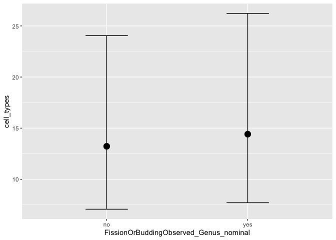<!-- -->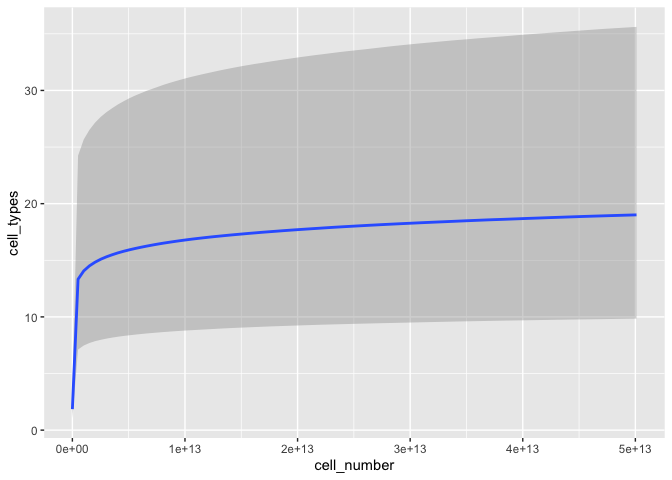<!-- -->

``` r
hyp = hypothesis(phylo_fit_fission_cell_type,  "FissionOrBuddingObserved_Genus_nominalno > FissionOrBuddingObserved_Genus_nominalyes") #test hypothesis that there is no difference based on coefficients
hyp
```

    ## Hypothesis Tests for class b:
    ##                 Hypothesis Estimate Est.Error CI.Lower CI.Upper Evid.Ratio
    ## 1 (FissionOrBudding... > 0    -0.09       0.1    -0.25     0.08       0.23
    ##   Post.Prob Star
    ## 1      0.19     
    ## ---
    ## 'CI': 90%-CI for one-sided and 95%-CI for two-sided hypotheses.
    ## '*': For one-sided hypotheses, the posterior probability exceeds 95%;
    ## for two-sided hypotheses, the value tested against lies outside the 95%-CI.
    ## Posterior probabilities of point hypotheses assume equal prior probabilities.

``` r
plot(hyp)
```

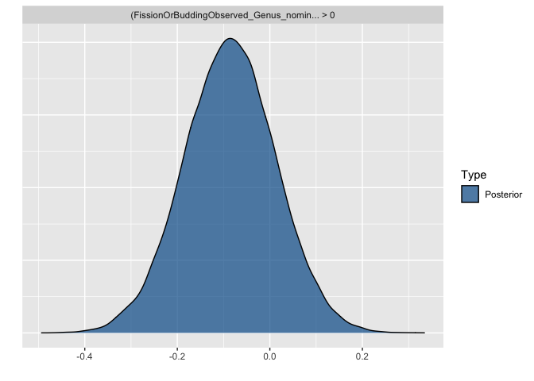<!-- -->

### Does germline timing correlate with increased cell number?

``` r
#fit the model 
phylofit_germline_cell_num<-
  brm(data = df,
      family=gaussian(), # family of model
      formula = log(cell_number) ~ 0 + germline_timing_simple  + (1|gr(species_id, cov = CovarMatrix)),  #formula, the 0 means that there are estimates for both clonal and non-clonal, rather than relative to each other
      data2 = list(CovarMatrix = CovarMatrix) ,
      iter = 1000000, warmup = 100000, chains = 5,thin = 1000, cores = 5, #chain settings
      prior = prior(normal(0, 10), "b"), #defining the priors- for things in 'class b' set this prior. (can also use get_priors() and set_priors() fucncitons) 
      file = 'fits/fit_phy_GermCellNum' ) 

plot(phylofit_germline_cell_num) #check that chains converged
```

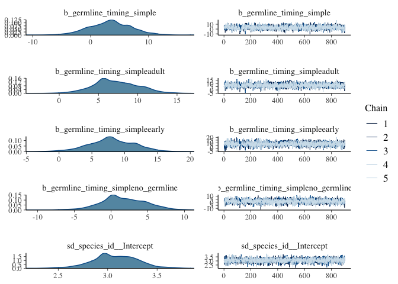<!-- -->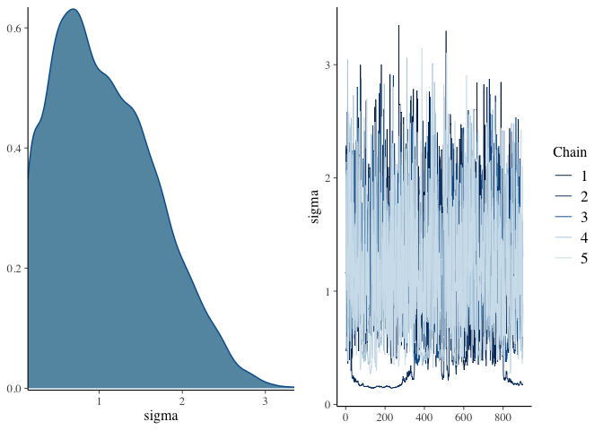<!-- -->

``` r
pp_check(phylofit_germline_cell_num) #check the predictions
```

    ## Using 10 posterior samples for ppc type 'dens_overlay' by default.

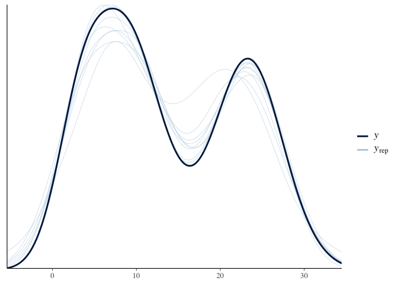<!-- -->

``` r
plot(conditional_effects(phylofit_germline_cell_num), points = TRUE) 
```

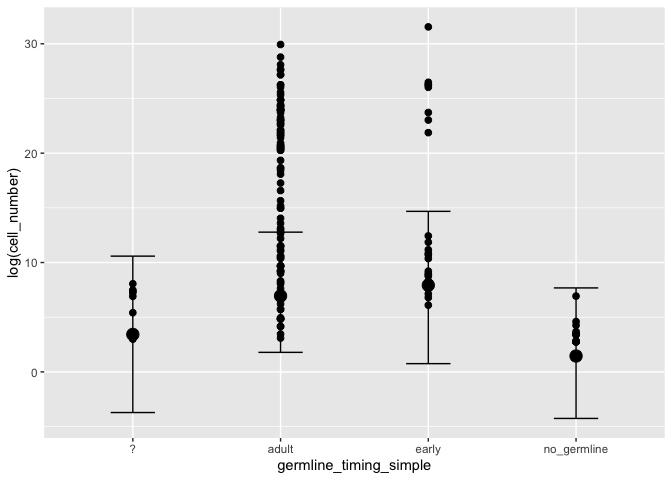<!-- -->

``` r
summary(phylofit_germline_cell_num)
```

    ## Warning: Parts of the model have not converged (some Rhats are > 1.05). Be
    ## careful when analysing the results! We recommend running more iterations and/or
    ## setting stronger priors.

    ## Warning: There were 1219 divergent transitions after warmup.
    ## Increasing adapt_delta above 0.8 may help. See http://mc-stan.org/misc/
    ## warnings.html#divergent-transitions-after-warmup

    ##  Family: gaussian 
    ##   Links: mu = identity; sigma = identity 
    ## Formula: log(cell_number) ~ 0 + germline_timing_simple + (1 | gr(species_id, cov = CovarMatrix)) 
    ##    Data: df (Number of observations: 158) 
    ## Samples: 5 chains, each with iter = 1e+06; warmup = 1e+05; thin = 1000;
    ##          total post-warmup samples = 4500
    ## 
    ## Group-Level Effects: 
    ## ~species_id (Number of levels: 158) 
    ##               Estimate Est.Error l-95% CI u-95% CI Rhat Bulk_ESS Tail_ESS
    ## sd(Intercept)     3.07      0.23     2.60     3.54 1.01      979     1539
    ## 
    ## Population-Level Effects: 
    ##                                   Estimate Est.Error l-95% CI u-95% CI Rhat
    ## germline_timing_simple                3.39      3.62    -3.72    10.58 1.05
    ## germline_timing_simpleadult           7.16      2.85     1.79    12.78 1.01
    ## germline_timing_simpleearly           8.03      3.54     0.75    14.68 1.07
    ## germline_timing_simpleno_germline     1.67      3.06    -4.26     7.68 1.01
    ##                                   Bulk_ESS Tail_ESS
    ## germline_timing_simple                 733      756
    ## germline_timing_simpleadult            454     1575
    ## germline_timing_simpleearly            908     1652
    ## germline_timing_simpleno_germline      516      604
    ## 
    ## Family Specific Parameters: 
    ##       Estimate Est.Error l-95% CI u-95% CI Rhat Bulk_ESS Tail_ESS
    ## sigma     1.07      0.62     0.16     2.42 1.13       26       15
    ## 
    ## Samples were drawn using sampling(NUTS). For each parameter, Bulk_ESS
    ## and Tail_ESS are effective sample size measures, and Rhat is the potential
    ## scale reduction factor on split chains (at convergence, Rhat = 1).

``` r
pairs(phylofit_germline_cell_num)
```

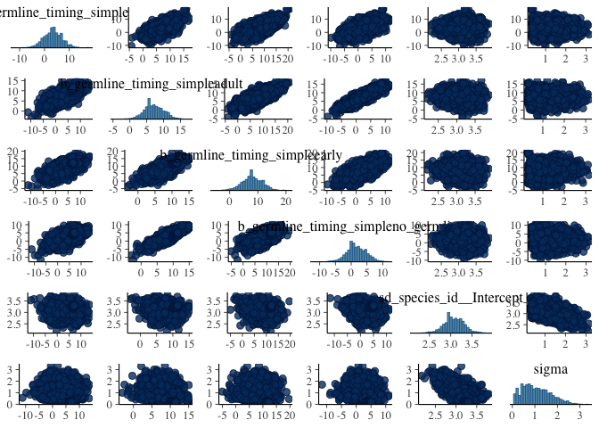<!-- -->

``` r
posterior_summary(phylofit_germline_cell_num, robust = T) #what are the medians for coefficients? if F, then returns means
```

    ##                                          Estimate   Est.Error         Q2.5
    ## b_germline_timing_simple               3.42609702   3.6456708   -3.7159027
    ## b_germline_timing_simpleadult          6.94899423   2.7580361    1.7860413
    ## b_germline_timing_simpleearly          7.92744534   3.4688554    0.7547506
    ## b_germline_timing_simpleno_germline    1.45206392   2.9379109   -4.2551620
    ## sd_species_id__Intercept               3.06991955   0.2213336    2.6024103
    ## sigma                                  0.99502613   0.6726738    0.1572766
    ## r_species_id[ott1002450,Intercept]     1.99248457   3.1427736   -4.6126736
    ## r_species_id[ott1017821,Intercept]    -2.44198237   2.8902686   -8.7713890
    ## r_species_id[ott1052546,Intercept]    -2.49751459   2.9512065   -8.6516385
    ## r_species_id[ott1059898,Intercept]     2.69648232   2.9565248   -3.5877554
    ## r_species_id[ott1059900,Intercept]     4.42144197   2.8602242   -1.7698357
    ## r_species_id[ott1061937,Intercept]     5.21777302   3.2056694   -1.2970632
    ## r_species_id[ott1069171,Intercept]    12.89776745   3.0907144    6.3493268
    ## r_species_id[ott1072227,Intercept]     1.36479575   3.1496192   -5.2944196
    ## r_species_id[ott108923,Intercept]      6.42116650   2.8962205    0.0585727
    ## r_species_id[ott1099013,Intercept]    16.71123899   2.9976380   10.3016515
    ## r_species_id[ott111442,Intercept]      4.14997692   2.9174191   -2.3898715
    ## r_species_id[ott112015,Intercept]      1.38380173   3.1223632   -5.3487446
    ## r_species_id[ott112016,Intercept]      1.32546634   3.1646132   -5.2844625
    ## r_species_id[ott112017,Intercept]      1.39743015   3.1020625   -5.2775496
    ## r_species_id[ott127047,Intercept]     -1.32046531   2.9488586   -7.6543353
    ## r_species_id[ott150272,Intercept]      0.91356133   3.6896357   -6.1488996
    ## r_species_id[ott160850,Intercept]      4.28155395   3.0200759   -2.0567609
    ## r_species_id[ott165368,Intercept]     18.26608355   3.6564003   11.0940846
    ## r_species_id[ott167121,Intercept]      1.97279873   3.1423902   -4.5767761
    ## r_species_id[ott178177,Intercept]     11.49194801   2.9418538    5.3123222
    ## r_species_id[ott178412,Intercept]     21.65296687   3.6160306   14.5234964
    ## r_species_id[ott181933,Intercept]     20.88945002   3.0706221   14.4472348
    ## r_species_id[ott182906,Intercept]     17.85575975   3.7717719   10.2898994
    ## r_species_id[ott186999,Intercept]     15.48258608   3.0682561    8.9880251
    ## r_species_id[ott187583,Intercept]      0.48420714   3.7079441   -6.7719007
    ## r_species_id[ott199292,Intercept]      8.15618309   2.9052406    1.7394949
    ## r_species_id[ott207134,Intercept]     14.82046344   3.0890899    8.2342038
    ## r_species_id[ott215125,Intercept]     17.04780517   3.0296852   10.6943253
    ## r_species_id[ott216694,Intercept]     20.57633699   2.9991104   14.2350655
    ## r_species_id[ott223669,Intercept]     18.32127823   3.5780760   11.1501061
    ## r_species_id[ott225275,Intercept]     15.95346285   3.0387438    9.6030852
    ## r_species_id[ott237608,Intercept]     13.61451538   3.1159507    7.2030857
    ## r_species_id[ott246046,Intercept]      2.86706788   2.9690903   -3.3822520
    ## r_species_id[ott247341,Intercept]     23.13567656   3.7908746   15.5790049
    ## r_species_id[ott256062,Intercept]     -1.85228487   3.0312856   -8.1407918
    ## r_species_id[ott256089,Intercept]     -2.73974852   2.9268494   -9.0407435
    ## r_species_id[ott256145,Intercept]      1.94302256   3.1780957   -4.6403117
    ## r_species_id[ott263960,Intercept]     13.47673814   2.9594704    7.1377876
    ## r_species_id[ott263980,Intercept]     13.44234583   2.8967691    7.0527766
    ## r_species_id[ott263987,Intercept]     10.20848233   2.9407667    3.8640036
    ## r_species_id[ott263988,Intercept]     17.08183159   2.9831368   10.8030290
    ## r_species_id[ott265121,Intercept]     18.61695575   3.2678123   12.0950826
    ## r_species_id[ott266342,Intercept]     -0.29619258   3.6732210   -7.3026446
    ## r_species_id[ott269063,Intercept]     -3.56660684   2.9687525   -9.9243034
    ## r_species_id[ott275893,Intercept]     13.30450586   2.9866750    6.9807543
    ## r_species_id[ott275897,Intercept]     13.50833109   3.0039604    7.0727087
    ## r_species_id[ott2810724,Intercept]     2.76668807   3.0895863   -3.6323004
    ## r_species_id[ott2819986,Intercept]    16.96108671   3.1398783   10.4588710
    ## r_species_id[ott2821097,Intercept]    15.69010390   2.9406497    9.3759467
    ## r_species_id[ott2844172,Intercept]     1.50774439   2.8509191   -4.6514498
    ## r_species_id[ott2844962,Intercept]    -0.57565840   3.7060614   -7.6647618
    ## r_species_id[ott2849837,Intercept]     3.46389802   3.6532630   -3.7215632
    ## r_species_id[ott2942244,Intercept]     3.90556403   3.5896535   -3.5817513
    ## r_species_id[ott316441,Intercept]     14.46891891   3.8060252    6.5829094
    ## r_species_id[ott33153,Intercept]       2.76654615   3.1500854   -3.8409630
    ## r_species_id[ott336388,Intercept]     20.19959878   2.9828704   13.8594616
    ## r_species_id[ott34559,Intercept]      15.93241800   3.0438044    9.6030731
    ## r_species_id[ott346740,Intercept]     17.62853833   3.0595821   11.1997227
    ## r_species_id[ott3583594,Intercept]     1.25776392   3.6156530   -5.7921409
    ## r_species_id[ott3587677,Intercept]    -1.60144594   3.6725880   -8.7130917
    ## r_species_id[ott359012,Intercept]      1.15370950   3.1317373   -5.5065089
    ## r_species_id[ott361837,Intercept]      1.38683611   3.1577040   -5.1174253
    ## r_species_id[ott362913,Intercept]      3.64090147   2.9667473   -2.5892624
    ## r_species_id[ott365439,Intercept]      2.64362445   3.6546246   -4.4362197
    ## r_species_id[ott3663378,Intercept]    11.47421845   3.0462018    5.1049713
    ## r_species_id[ott3665433,Intercept]     5.81339435   2.9501901   -0.6665857
    ## r_species_id[ott3684291,Intercept]     3.68059006   3.6682166   -3.6402663
    ## r_species_id[ott3684365,Intercept]     3.68524142   3.8216736   -3.7348955
    ## r_species_id[ott3684379,Intercept]    -0.26437453   3.7188512   -7.7094875
    ## r_species_id[ott3684389,Intercept]     1.87115411   3.7640400   -5.5216986
    ## r_species_id[ott3684437,Intercept]     0.10531841   3.7667654   -7.3671871
    ## r_species_id[ott381979,Intercept]      0.07545832   3.1714416   -6.4692737
    ## r_species_id[ott381980,Intercept]      3.15061568   3.0181040   -3.0659893
    ## r_species_id[ott381983,Intercept]      1.42510730   3.1601900   -5.2907148
    ## r_species_id[ott395048,Intercept]     -0.91550393   3.6129023   -8.1141451
    ## r_species_id[ott3974169,Intercept]    16.42041740   2.9891857   10.1048277
    ## r_species_id[ott3995126,Intercept]    17.25348914   2.9784545   10.9391138
    ## r_species_id[ott4010019,Intercept]    16.89671441   3.0527541   10.5078719
    ## r_species_id[ott4010960,Intercept]    17.51016712   3.0617215   11.2412477
    ## r_species_id[ott4011155,Intercept]     9.62347559   2.9721812    3.3378038
    ## r_species_id[ott4013437,Intercept]    14.71955896   2.9335587    8.3782738
    ## r_species_id[ott4013674,Intercept]    18.70181814   3.2871587   12.1143216
    ## r_species_id[ott4013684,Intercept]    17.51054434   3.0075544   11.1886814
    ## r_species_id[ott422679,Intercept]     -0.97423142   2.9103515   -7.2017202
    ## r_species_id[ott431388,Intercept]      6.97739851   2.8877422    0.6814831
    ## r_species_id[ott446088,Intercept]      1.32319190   3.5773095   -5.7996969
    ## r_species_id[ott4741377,Intercept]    13.99963649   2.8507502    7.6265131
    ## r_species_id[ott4742064,Intercept]    18.51964072   3.1167009   12.1215465
    ## r_species_id[ott481952,Intercept]     17.76931948   3.1216327   11.3128112
    ## r_species_id[ott48288,Intercept]      13.97031156   3.6629563    6.6845715
    ## r_species_id[ott485470,Intercept]      0.80390618   2.9314680   -5.4854365
    ## r_species_id[ott485473,Intercept]     -1.94982316   2.9416871   -8.3141669
    ## r_species_id[ott485476,Intercept]      2.03448142   3.1948426   -4.5187330
    ## r_species_id[ott485480,Intercept]      2.85573507   2.8905770   -3.4734327
    ## r_species_id[ott485482,Intercept]     -0.19741340   3.6021613   -7.2245065
    ## r_species_id[ott486834,Intercept]     -0.48002539   2.9151835   -6.6600791
    ## r_species_id[ott490206,Intercept]      6.07762948   2.9605807   -0.2296249
    ## r_species_id[ott492241,Intercept]      0.41730912   3.5978065   -6.8361696
    ## r_species_id[ott497063,Intercept]     15.25999836   2.9443174    8.8406783
    ## r_species_id[ott4974308,Intercept]     3.53660223   3.7307520   -3.4657145
    ## r_species_id[ott4978773,Intercept]     0.37881144   3.5804178   -6.9353975
    ## r_species_id[ott4979583,Intercept]     1.00861474   3.6287590   -6.2045681
    ## r_species_id[ott518643,Intercept]      2.75854245   3.6555856   -4.4680771
    ## r_species_id[ott542509,Intercept]     18.18213933   3.6517812   11.1272922
    ## r_species_id[ott54768,Intercept]       8.18420835   2.8923099    1.9507345
    ## r_species_id[ott549846,Intercept]      4.74083427   3.6619935   -2.4375890
    ## r_species_id[ott560703,Intercept]     -1.63007544   2.9447662   -7.8502168
    ## r_species_id[ott567703,Intercept]     16.55500608   2.9938550   10.2395458
    ## r_species_id[ott570365,Intercept]     -0.59361246   2.9089921   -6.8047860
    ## r_species_id[ott570656,Intercept]     10.74616928   2.8642878    4.3919411
    ## r_species_id[ott588761,Intercept]      2.33120224   2.8842811   -3.8938261
    ## r_species_id[ott592355,Intercept]     13.40483816   3.0234342    6.9420724
    ## r_species_id[ott601255,Intercept]     21.69473354   3.0268391   15.5007789
    ## r_species_id[ott602180,Intercept]      2.93457208   3.1365028   -3.5999943
    ## r_species_id[ott60470,Intercept]       1.39618962   3.1203269   -5.2535733
    ## r_species_id[ott60471,Intercept]       0.16468220   3.1121325   -6.5743876
    ## r_species_id[ott60473,Intercept]       1.35678423   3.0928190   -5.2429519
    ## r_species_id[ott60477,Intercept]       1.97370612   3.1279173   -4.5848178
    ## r_species_id[ott60479,Intercept]       1.96210543   3.1961951   -4.6032556
    ## r_species_id[ott633708,Intercept]      1.27321610   2.9592504   -5.0549390
    ## r_species_id[ott633710,Intercept]      3.10589836   3.0613512   -3.2264370
    ## r_species_id[ott633711,Intercept]      2.19313503   3.0130682   -4.1751793
    ## r_species_id[ott633717,Intercept]     -1.75346194   2.9318813   -7.8962363
    ## r_species_id[ott633719,Intercept]      2.51462638   2.9838484   -3.4990162
    ## r_species_id[ott643237,Intercept]     16.96590634   2.9280293   10.6062376
    ## r_species_id[ott645555,Intercept]     18.04690989   3.1404421   11.5311445
    ## r_species_id[ott649193,Intercept]     17.15458996   2.9779022   10.9212025
    ## r_species_id[ott675301,Intercept]      4.57942842   3.7989146   -2.9202518
    ## r_species_id[ott724784,Intercept]      9.19116642   2.9593729    2.7569315
    ## r_species_id[ott72522,Intercept]      20.04617326   3.1756108   13.6771267
    ## r_species_id[ott727979,Intercept]     20.20716137   2.9584707   14.0357246
    ## r_species_id[ott733462,Intercept]     15.32888217   2.9895088    8.9487199
    ## r_species_id[ott736728,Intercept]      6.04643791   2.8926198   -0.2394106
    ## r_species_id[ott742128,Intercept]      2.37489489   2.9415381   -3.8099022
    ## r_species_id[ott7489702,Intercept]     3.31325834   3.6790343   -3.9640158
    ## r_species_id[ott7567530,Intercept]     4.33282817   2.9681354   -1.9628493
    ## r_species_id[ott765113,Intercept]     -0.02461901   2.8583603   -6.4118349
    ## r_species_id[ott765280,Intercept]     12.41985895   2.8923847    6.1641610
    ## r_species_id[ott779028,Intercept]     14.97761511   2.9209996    8.7158426
    ## r_species_id[ott790395,Intercept]     15.89123643   2.9848584    9.6201912
    ## r_species_id[ott817791,Intercept]     14.63765678   2.9837927    8.4801986
    ## r_species_id[ott821356,Intercept]     13.71334146   2.9260621    7.5753622
    ## r_species_id[ott83430,Intercept]      11.93109994   2.8644073    5.5938699
    ## r_species_id[ott83432,Intercept]       4.08223448   3.1574516   -2.1933020
    ## r_species_id[ott840001,Intercept]     16.97426602   2.9690336   10.5690754
    ## r_species_id[ott841027,Intercept]     -0.21681980   3.6640707   -7.3510218
    ## r_species_id[ott849781,Intercept]     14.31689554   3.0814300    7.8551707
    ## r_species_id[ott878345,Intercept]      6.47210781   2.9256936    0.1275615
    ## r_species_id[ott92556,Intercept]      11.79522305   2.9340454    5.4919601
    ## r_species_id[ott92561,Intercept]      14.53863187   3.0413480    8.1480597
    ## r_species_id[ott939432,Intercept]      4.43490975   2.9992834   -1.6122673
    ## r_species_id[ott939454,Intercept]      4.42285415   2.9029234   -1.8886801
    ## r_species_id[ott954042,Intercept]     15.17407791   3.8380761    7.4936067
    ## r_species_id[ott958293,Intercept]      1.92558216   3.1350384   -4.6770866
    ## r_species_id[ott958304,Intercept]      1.33031325   3.1731860   -5.2235961
    ## r_species_id[ott962359,Intercept]      1.34967534   2.9298475   -5.0495190
    ## r_species_id[ott987480,Intercept]      4.09015188   3.7093487   -3.3000607
    ## r_species_id[ott989764,Intercept]      6.74657781   2.9847310    0.3861690
    ## lp__                                -464.69202078 107.0026800 -603.9722980
    ##                                           Q97.5
    ## b_germline_timing_simple              10.584152
    ## b_germline_timing_simpleadult         12.777312
    ## b_germline_timing_simpleearly         14.678657
    ## b_germline_timing_simpleno_germline    7.678403
    ## sd_species_id__Intercept               3.540341
    ## sigma                                  2.421592
    ## r_species_id[ott1002450,Intercept]     8.080142
    ## r_species_id[ott1017821,Intercept]     3.096677
    ## r_species_id[ott1052546,Intercept]     3.092212
    ## r_species_id[ott1059898,Intercept]     8.360771
    ## r_species_id[ott1059900,Intercept]    10.018602
    ## r_species_id[ott1061937,Intercept]    11.290418
    ## r_species_id[ott1069171,Intercept]    18.360529
    ## r_species_id[ott1072227,Intercept]     7.485817
    ## r_species_id[ott108923,Intercept]     12.115871
    ## r_species_id[ott1099013,Intercept]    22.360271
    ## r_species_id[ott111442,Intercept]      9.765671
    ## r_species_id[ott112015,Intercept]      7.414733
    ## r_species_id[ott112016,Intercept]      7.569822
    ## r_species_id[ott112017,Intercept]      7.568846
    ## r_species_id[ott127047,Intercept]      4.486614
    ## r_species_id[ott150272,Intercept]      8.339389
    ## r_species_id[ott160850,Intercept]     10.036152
    ## r_species_id[ott165368,Intercept]     25.491013
    ## r_species_id[ott167121,Intercept]      8.106051
    ## r_species_id[ott178177,Intercept]     16.824146
    ## r_species_id[ott178412,Intercept]     27.739002
    ## r_species_id[ott181933,Intercept]     26.518745
    ## r_species_id[ott182906,Intercept]     25.421414
    ## r_species_id[ott186999,Intercept]     20.964725
    ## r_species_id[ott187583,Intercept]      7.796460
    ## r_species_id[ott199292,Intercept]     13.881953
    ## r_species_id[ott207134,Intercept]     20.395623
    ## r_species_id[ott215125,Intercept]     22.608542
    ## r_species_id[ott216694,Intercept]     26.236077
    ## r_species_id[ott223669,Intercept]     25.674663
    ## r_species_id[ott225275,Intercept]     21.583097
    ## r_species_id[ott237608,Intercept]     19.229417
    ## r_species_id[ott246046,Intercept]      8.558250
    ## r_species_id[ott247341,Intercept]     30.538422
    ## r_species_id[ott256062,Intercept]      3.632911
    ## r_species_id[ott256089,Intercept]      2.963400
    ## r_species_id[ott256145,Intercept]      8.124576
    ## r_species_id[ott263960,Intercept]     18.978043
    ## r_species_id[ott263980,Intercept]     19.045404
    ## r_species_id[ott263987,Intercept]     15.909342
    ## r_species_id[ott263988,Intercept]     22.690679
    ## r_species_id[ott265121,Intercept]     24.221400
    ## r_species_id[ott266342,Intercept]      7.269712
    ## r_species_id[ott269063,Intercept]      2.086037
    ## r_species_id[ott275893,Intercept]     18.882209
    ## r_species_id[ott275897,Intercept]     19.213665
    ## r_species_id[ott2810724,Intercept]     9.034601
    ## r_species_id[ott2819986,Intercept]    22.726545
    ## r_species_id[ott2821097,Intercept]    21.355180
    ## r_species_id[ott2844172,Intercept]     7.200757
    ## r_species_id[ott2844962,Intercept]     6.831467
    ## r_species_id[ott2849837,Intercept]    10.873544
    ## r_species_id[ott2942244,Intercept]    11.086764
    ## r_species_id[ott316441,Intercept]     21.974262
    ## r_species_id[ott33153,Intercept]       8.871727
    ## r_species_id[ott336388,Intercept]     25.708741
    ## r_species_id[ott34559,Intercept]      21.650336
    ## r_species_id[ott346740,Intercept]     23.188794
    ## r_species_id[ott3583594,Intercept]     8.921274
    ## r_species_id[ott3587677,Intercept]     5.917915
    ## r_species_id[ott359012,Intercept]      7.242999
    ## r_species_id[ott361837,Intercept]      7.531543
    ## r_species_id[ott362913,Intercept]      9.283738
    ## r_species_id[ott365439,Intercept]      9.964813
    ## r_species_id[ott3663378,Intercept]    17.027642
    ## r_species_id[ott3665433,Intercept]    11.271034
    ## r_species_id[ott3684291,Intercept]    10.977956
    ## r_species_id[ott3684365,Intercept]    11.288833
    ## r_species_id[ott3684379,Intercept]     7.490038
    ## r_species_id[ott3684389,Intercept]     9.599077
    ## r_species_id[ott3684437,Intercept]     7.544370
    ## r_species_id[ott381979,Intercept]      6.104060
    ## r_species_id[ott381980,Intercept]      8.687702
    ## r_species_id[ott381983,Intercept]      7.421631
    ## r_species_id[ott395048,Intercept]      6.611994
    ## r_species_id[ott3974169,Intercept]    22.042064
    ## r_species_id[ott3995126,Intercept]    22.965367
    ## r_species_id[ott4010019,Intercept]    22.548945
    ## r_species_id[ott4010960,Intercept]    23.248067
    ## r_species_id[ott4011155,Intercept]    15.354980
    ## r_species_id[ott4013437,Intercept]    20.304470
    ## r_species_id[ott4013674,Intercept]    24.359384
    ## r_species_id[ott4013684,Intercept]    23.145865
    ## r_species_id[ott422679,Intercept]      4.738644
    ## r_species_id[ott431388,Intercept]     12.553543
    ## r_species_id[ott446088,Intercept]      8.858681
    ## r_species_id[ott4741377,Intercept]    19.513781
    ## r_species_id[ott4742064,Intercept]    24.255354
    ## r_species_id[ott481952,Intercept]     23.459936
    ## r_species_id[ott48288,Intercept]      21.313354
    ## r_species_id[ott485470,Intercept]      6.318466
    ## r_species_id[ott485473,Intercept]      3.663854
    ## r_species_id[ott485476,Intercept]      8.266321
    ## r_species_id[ott485480,Intercept]      8.371440
    ## r_species_id[ott485482,Intercept]      7.142573
    ## r_species_id[ott486834,Intercept]      5.051734
    ## r_species_id[ott490206,Intercept]     11.590345
    ## r_species_id[ott492241,Intercept]      7.724865
    ## r_species_id[ott497063,Intercept]     20.789252
    ## r_species_id[ott4974308,Intercept]    11.307968
    ## r_species_id[ott4978773,Intercept]     7.895545
    ## r_species_id[ott4979583,Intercept]     8.408380
    ## r_species_id[ott518643,Intercept]     10.140600
    ## r_species_id[ott542509,Intercept]     25.670022
    ## r_species_id[ott54768,Intercept]      13.626398
    ## r_species_id[ott549846,Intercept]     12.427059
    ## r_species_id[ott560703,Intercept]      4.096789
    ## r_species_id[ott567703,Intercept]     22.038235
    ## r_species_id[ott570365,Intercept]      5.349493
    ## r_species_id[ott570656,Intercept]     16.363404
    ## r_species_id[ott588761,Intercept]      8.044289
    ## r_species_id[ott592355,Intercept]     18.994390
    ## r_species_id[ott601255,Intercept]     27.258008
    ## r_species_id[ott602180,Intercept]      9.010865
    ## r_species_id[ott60470,Intercept]       7.548191
    ## r_species_id[ott60471,Intercept]       6.270965
    ## r_species_id[ott60473,Intercept]       7.631676
    ## r_species_id[ott60477,Intercept]       8.200983
    ## r_species_id[ott60479,Intercept]       8.055455
    ## r_species_id[ott633708,Intercept]      7.047696
    ## r_species_id[ott633710,Intercept]      8.671270
    ## r_species_id[ott633711,Intercept]      7.744483
    ## r_species_id[ott633717,Intercept]      3.987609
    ## r_species_id[ott633719,Intercept]      8.202503
    ## r_species_id[ott643237,Intercept]     22.423775
    ## r_species_id[ott645555,Intercept]     23.765726
    ## r_species_id[ott649193,Intercept]     22.966079
    ## r_species_id[ott675301,Intercept]     11.922598
    ## r_species_id[ott724784,Intercept]     15.069359
    ## r_species_id[ott72522,Intercept]      25.684691
    ## r_species_id[ott727979,Intercept]     25.941179
    ## r_species_id[ott733462,Intercept]     21.054448
    ## r_species_id[ott736728,Intercept]     11.946389
    ## r_species_id[ott742128,Intercept]      7.965908
    ## r_species_id[ott7489702,Intercept]    10.748996
    ## r_species_id[ott7567530,Intercept]    10.175107
    ## r_species_id[ott765113,Intercept]      5.536461
    ## r_species_id[ott765280,Intercept]     18.051418
    ## r_species_id[ott779028,Intercept]     20.673285
    ## r_species_id[ott790395,Intercept]     21.519641
    ## r_species_id[ott817791,Intercept]     20.208496
    ## r_species_id[ott821356,Intercept]     19.353658
    ## r_species_id[ott83430,Intercept]      17.731100
    ## r_species_id[ott83432,Intercept]      11.018759
    ## r_species_id[ott840001,Intercept]     22.610799
    ## r_species_id[ott841027,Intercept]      7.302418
    ## r_species_id[ott849781,Intercept]     19.963530
    ## r_species_id[ott878345,Intercept]     12.482267
    ## r_species_id[ott92556,Intercept]      17.358841
    ## r_species_id[ott92561,Intercept]      20.181519
    ## r_species_id[ott939432,Intercept]     10.125099
    ## r_species_id[ott939454,Intercept]      9.987044
    ## r_species_id[ott954042,Intercept]     22.653094
    ## r_species_id[ott958293,Intercept]      7.839058
    ## r_species_id[ott958304,Intercept]      7.348908
    ## r_species_id[ott962359,Intercept]      7.056204
    ## r_species_id[ott987480,Intercept]     11.605380
    ## r_species_id[ott989764,Intercept]     12.362309
    ## lp__                                -185.063333

``` r
hyp = hypothesis(phylofit_germline_cell_num,  c("germline_timing_simpleearly = germline_timing_simple", "germline_timing_simpleearly = germline_timing_simpleadult", "germline_timing_simpleearly = germline_timing_simpleno_germline")) #test hypothesis that there is no difference based on coefficients
hyp
```

    ## Hypothesis Tests for class b:
    ##                 Hypothesis Estimate Est.Error CI.Lower CI.Upper Evid.Ratio
    ## 1 (germline_timing_... = 0     4.64      2.86    -1.12    10.49         NA
    ## 2 (germline_timing_... = 0     0.87      2.39    -4.02     5.51         NA
    ## 3 (germline_timing_... = 0     6.36      2.71     0.74    11.56         NA
    ##   Post.Prob Star
    ## 1        NA     
    ## 2        NA     
    ## 3        NA    *
    ## ---
    ## 'CI': 90%-CI for one-sided and 95%-CI for two-sided hypotheses.
    ## '*': For one-sided hypotheses, the posterior probability exceeds 95%;
    ## for two-sided hypotheses, the value tested against lies outside the 95%-CI.
    ## Posterior probabilities of point hypotheses assume equal prior probabilities.

``` r
plot(hyp)
```

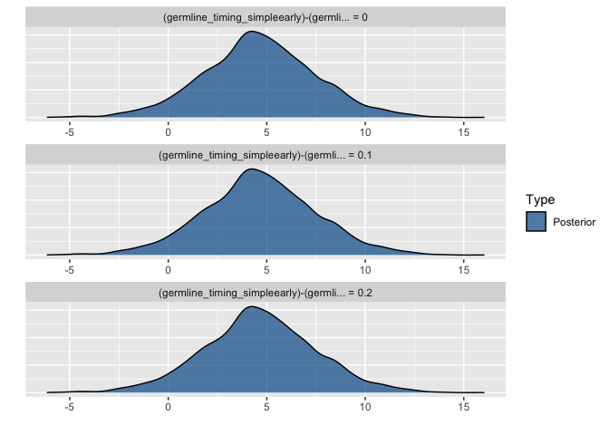<!-- -->

### Does germline timing correlate with increased cell types (per cell)?

``` r
fit_type_phy<-
  brm(data = df,
      family=poisson(),
      formula = cell_types ~ 0 + germline_timing_simple + scale(log(cell_number)) + (1|gr(species_id, cov = CovarMatrix)),
      iter = 1000000, warmup = 100000, chains = 5, thin = 1000, cores = 5,
      prior = prior(normal(0, 10), "b"), file = 'fits/fit_phy_GermCellType', # same simple prior
      data2 = list(CovarMatrix = CovarMatrix))

plot(fit_type_phy) #check that chains converged
```

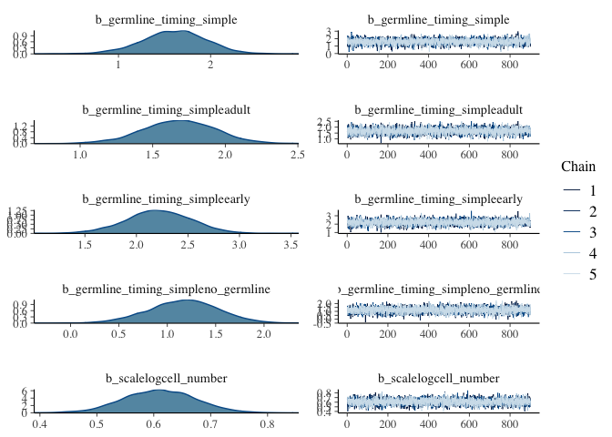<!-- --><!-- -->

``` r
pp_check(fit_type_phy) #check the predictions
```

    ## Using 10 posterior samples for ppc type 'dens_overlay' by default.

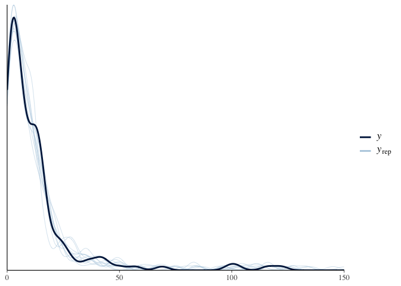<!-- -->

``` r
summary(fit_type_phy) #summary of model 
```

    ##  Family: poisson 
    ##   Links: mu = log 
    ## Formula: cell_types ~ 0 + germline_timing_simple + scale(log(cell_number)) + (1 | gr(species_id, cov = CovarMatrix)) 
    ##    Data: df (Number of observations: 157) 
    ## Samples: 5 chains, each with iter = 1e+06; warmup = 1e+05; thin = 1000;
    ##          total post-warmup samples = 4500
    ## 
    ## Group-Level Effects: 
    ## ~species_id (Number of levels: 157) 
    ##               Estimate Est.Error l-95% CI u-95% CI Rhat Bulk_ESS Tail_ESS
    ## sd(Intercept)     0.19      0.02     0.15     0.24 1.00     4597     4296
    ## 
    ## Population-Level Effects: 
    ##                                   Estimate Est.Error l-95% CI u-95% CI Rhat
    ## germline_timing_simple                1.60      0.35     0.89     2.26 1.00
    ## germline_timing_simpleadult           1.68      0.25     1.17     2.17 1.00
    ## germline_timing_simpleearly           2.22      0.32     1.58     2.82 1.00
    ## germline_timing_simpleno_germline     1.17      0.36     0.45     1.86 1.00
    ## scalelogcell_number                   0.61      0.06     0.49     0.73 1.00
    ##                                   Bulk_ESS Tail_ESS
    ## germline_timing_simple                4328     4042
    ## germline_timing_simpleadult           4395     4376
    ## germline_timing_simpleearly           4580     4207
    ## germline_timing_simpleno_germline     4673     4361
    ## scalelogcell_number                   4593     4486
    ## 
    ## Samples were drawn using sampling(NUTS). For each parameter, Bulk_ESS
    ## and Tail_ESS are effective sample size measures, and Rhat is the potential
    ## scale reduction factor on split chains (at convergence, Rhat = 1).

``` r
posterior_summary(fit_type_phy, robust = T)
```

    ##                                          Estimate   Est.Error          Q2.5
    ## b_germline_timing_simple             1.613862e+00  0.34229785  8.900840e-01
    ## b_germline_timing_simpleadult        1.683416e+00  0.24941465  1.174107e+00
    ## b_germline_timing_simpleearly        2.212725e+00  0.31195555  1.583920e+00
    ## b_germline_timing_simpleno_germline  1.175380e+00  0.35251608  4.527177e-01
    ## b_scalelogcell_number                6.101713e-01  0.06365627  4.865558e-01
    ## sd_species_id__Intercept             1.895796e-01  0.02117920  1.512694e-01
    ## r_species_id[ott1017821,Intercept]  -1.320057e-01  0.37621521 -8.752720e-01
    ## r_species_id[ott1052546,Intercept]  -1.327601e-01  0.38675465 -8.700756e-01
    ## r_species_id[ott1059898,Intercept]   6.956797e-01  0.33521919  2.696798e-02
    ## r_species_id[ott1059900,Intercept]   7.127724e-01  0.32469653  6.029043e-02
    ## r_species_id[ott1061937,Intercept]  -5.790327e-01  0.41726509 -1.415903e+00
    ## r_species_id[ott1069171,Intercept]   6.282759e-01  0.31541029  4.312902e-02
    ## r_species_id[ott1072227,Intercept]  -3.835338e-01  0.40294286 -1.202793e+00
    ## r_species_id[ott108923,Intercept]    7.422910e-01  0.31742357  1.219379e-01
    ## r_species_id[ott1099013,Intercept]  -4.105269e-01  0.32951555 -1.050182e+00
    ## r_species_id[ott111442,Intercept]    9.204121e-01  0.33209181  2.836621e-01
    ## r_species_id[ott112015,Intercept]   -3.784360e-01  0.40328873 -1.209839e+00
    ## r_species_id[ott112016,Intercept]   -3.755042e-01  0.40809570 -1.179680e+00
    ## r_species_id[ott112017,Intercept]   -3.859473e-01  0.40661784 -1.183408e+00
    ## r_species_id[ott127047,Intercept]    6.900156e-01  0.33181285  2.906827e-02
    ## r_species_id[ott150272,Intercept]    1.000047e+00  0.35452628  3.291106e-01
    ## r_species_id[ott160850,Intercept]   -2.773533e-01  0.37531692 -1.003980e+00
    ## r_species_id[ott165368,Intercept]    1.621118e+00  0.33568207  9.709559e-01
    ## r_species_id[ott167121,Intercept]   -3.755459e-01  0.36739297 -1.118421e+00
    ## r_species_id[ott178177,Intercept]    1.721172e-01  0.33809655 -5.016634e-01
    ## r_species_id[ott178412,Intercept]    4.955721e-01  0.30554917 -1.132571e-01
    ## r_species_id[ott181933,Intercept]   -3.338145e-01  0.34459883 -1.019382e+00
    ## r_species_id[ott182906,Intercept]    1.103289e+00  0.33851275  4.433805e-01
    ## r_species_id[ott186999,Intercept]    4.264693e-01  0.31764556 -2.236822e-01
    ## r_species_id[ott187583,Intercept]   -8.278403e-01  0.39791756 -1.621770e+00
    ## r_species_id[ott199292,Intercept]    8.110085e-01  0.32797561  1.745638e-01
    ## r_species_id[ott207134,Intercept]   -8.029681e-02  0.31328730 -6.952835e-01
    ## r_species_id[ott215125,Intercept]    1.319569e+00  0.29764254  7.397137e-01
    ## r_species_id[ott216694,Intercept]   -7.410767e-01  0.35552224 -1.448605e+00
    ## r_species_id[ott223669,Intercept]    1.660082e+00  0.33954264  9.850681e-01
    ## r_species_id[ott225275,Intercept]    9.320068e-01  0.30422771  3.422907e-01
    ## r_species_id[ott237608,Intercept]   -1.431173e-01  0.35030221 -8.315568e-01
    ## r_species_id[ott246046,Intercept]    2.789052e-01  0.33135693 -3.688767e-01
    ## r_species_id[ott247341,Intercept]    1.149895e+00  0.35331209  4.614924e-01
    ## r_species_id[ott256062,Intercept]   -5.335395e-01  0.40136615 -1.309569e+00
    ## r_species_id[ott256089,Intercept]   -4.657957e-01  0.35547547 -1.180120e+00
    ## r_species_id[ott256145,Intercept]   -3.812313e-01  0.41271320 -1.168378e+00
    ## r_species_id[ott263960,Intercept]    8.690192e-01  0.29711291  2.839766e-01
    ## r_species_id[ott263980,Intercept]   -5.503092e-01  0.36352350 -1.275152e+00
    ## r_species_id[ott263987,Intercept]   -4.317320e-01  0.36556780 -1.152812e+00
    ## r_species_id[ott263988,Intercept]   -4.413921e-01  0.33313591 -1.079220e+00
    ## r_species_id[ott265121,Intercept]   -4.803899e-01  0.33271585 -1.152188e+00
    ## r_species_id[ott266342,Intercept]   -8.651876e-01  0.41760990 -1.682602e+00
    ## r_species_id[ott269063,Intercept]   -1.795505e-01  0.41737849 -1.028845e+00
    ## r_species_id[ott275893,Intercept]   -1.398137e-01  0.34028910 -8.046466e-01
    ## r_species_id[ott275897,Intercept]   -1.219377e-01  0.33452841 -7.651139e-01
    ## r_species_id[ott2810724,Intercept]  -1.861746e-01  0.36157209 -8.784147e-01
    ## r_species_id[ott2819986,Intercept]  -4.886254e-01  0.34975464 -1.190270e+00
    ## r_species_id[ott2821097,Intercept]  -3.649568e-01  0.32391265 -1.008585e+00
    ## r_species_id[ott2844172,Intercept]   1.217628e+00  0.32187949  5.919885e-01
    ## r_species_id[ott2844962,Intercept]   9.763933e-01  0.34538065  2.695796e-01
    ## r_species_id[ott2849837,Intercept]   8.672245e-01  0.36532180  1.847016e-01
    ## r_species_id[ott2942244,Intercept]   8.027351e-01  0.34314852  9.865480e-02
    ## r_species_id[ott316441,Intercept]    1.018003e+00  0.34516340  3.460523e-01
    ## r_species_id[ott33153,Intercept]    -2.441729e-01  0.37159114 -9.815870e-01
    ## r_species_id[ott336388,Intercept]   -5.035005e-01  0.35713778 -1.200381e+00
    ## r_species_id[ott34559,Intercept]    -4.569033e-01  0.34296789 -1.127589e+00
    ## r_species_id[ott346740,Intercept]    8.581557e-01  0.30518910  2.694688e-01
    ## r_species_id[ott3583594,Intercept]   1.055770e+00  0.35978976  3.491975e-01
    ## r_species_id[ott3587677,Intercept]   1.360876e+00  0.35913420  6.611012e-01
    ## r_species_id[ott359012,Intercept]   -3.615247e-01  0.43186647 -1.237853e+00
    ## r_species_id[ott361837,Intercept]   -3.788062e-01  0.40723288 -1.186241e+00
    ## r_species_id[ott362913,Intercept]    1.002142e+00  0.31929447  3.802148e-01
    ## r_species_id[ott365439,Intercept]    4.892054e-01  0.37033641 -2.386455e-01
    ## r_species_id[ott3663378,Intercept]   6.216634e-01  0.31762264 -6.556566e-03
    ## r_species_id[ott3665433,Intercept]   9.649679e-01  0.32205313  3.367407e-01
    ## r_species_id[ott3684291,Intercept]   4.352979e-01  0.35561451 -2.601264e-01
    ## r_species_id[ott3684365,Intercept]   3.614566e-01  0.38175033 -4.359073e-01
    ## r_species_id[ott3684379,Intercept]   5.190988e-01  0.39660627 -2.902331e-01
    ## r_species_id[ott3684389,Intercept]   3.998355e-01  0.41107950 -4.162766e-01
    ## r_species_id[ott3684437,Intercept]   4.208434e-01  0.37629767 -2.983627e-01
    ## r_species_id[ott381979,Intercept]   -1.154885e-01  0.38870627 -8.899393e-01
    ## r_species_id[ott381980,Intercept]   -4.979959e-01  0.34588837 -1.198349e+00
    ## r_species_id[ott381983,Intercept]   -3.755452e-01  0.39921426 -1.200578e+00
    ## r_species_id[ott395048,Intercept]    1.361184e+00  0.36434368  6.727905e-01
    ## r_species_id[ott3974169,Intercept]   1.199039e+00  0.29873822  6.109624e-01
    ## r_species_id[ott3995126,Intercept]   1.166316e+00  0.30252630  5.934373e-01
    ## r_species_id[ott4010019,Intercept]   6.262726e-02  0.30879574 -5.419050e-01
    ## r_species_id[ott4010960,Intercept]   7.085555e-02  0.31338406 -5.468632e-01
    ## r_species_id[ott4011155,Intercept]   2.251828e-01  0.32349423 -3.869468e-01
    ## r_species_id[ott4013437,Intercept]   1.374208e-01  0.30652330 -4.715778e-01
    ## r_species_id[ott4013674,Intercept]  -6.224201e-03  0.30889343 -6.187875e-01
    ## r_species_id[ott4013684,Intercept]   4.780737e-02  0.30436749 -5.549839e-01
    ## r_species_id[ott422679,Intercept]   -1.152730e-01  0.32592483 -7.726485e-01
    ## r_species_id[ott431388,Intercept]    1.049885e+00  0.30867806  4.612936e-01
    ## r_species_id[ott446088,Intercept]    1.043963e+00  0.36168583  3.396957e-01
    ## r_species_id[ott4741377,Intercept]   1.052793e-01  0.30892501 -5.146019e-01
    ## r_species_id[ott4742064,Intercept]   6.431004e-02  0.30412416 -5.348935e-01
    ## r_species_id[ott481952,Intercept]    1.146571e+00  0.29415384  5.721267e-01
    ## r_species_id[ott48288,Intercept]     1.107873e+00  0.32968562  4.309378e-01
    ## r_species_id[ott485470,Intercept]   -4.882041e-01  0.34356081 -1.189752e+00
    ## r_species_id[ott485473,Intercept]   -5.165923e-01  0.38599016 -1.305146e+00
    ## r_species_id[ott485476,Intercept]   -3.763729e-01  0.36626065 -1.098182e+00
    ## r_species_id[ott485480,Intercept]   -6.107805e-01  0.40102465 -1.445477e+00
    ## r_species_id[ott485482,Intercept]   -7.653628e-01  0.38189203 -1.517469e+00
    ## r_species_id[ott486834,Intercept]   -1.921825e-01  0.36292181 -9.047032e-01
    ## r_species_id[ott490206,Intercept]    9.988855e-01  0.31539995  3.760750e-01
    ## r_species_id[ott492241,Intercept]    8.215615e-01  0.35338947  1.085340e-01
    ## r_species_id[ott497063,Intercept]   -4.437932e-01  0.33515440 -1.132447e+00
    ## r_species_id[ott4974308,Intercept]   6.617621e-01  0.36636565 -5.309627e-02
    ## r_species_id[ott4978773,Intercept]   8.676252e-01  0.35530820  1.651940e-01
    ## r_species_id[ott4979583,Intercept]   8.036261e-01  0.35878839  9.233255e-02
    ## r_species_id[ott518643,Intercept]    6.421357e-01  0.36493056 -6.747939e-02
    ## r_species_id[ott542509,Intercept]    1.479780e+00  0.34603074  8.173515e-01
    ## r_species_id[ott54768,Intercept]     7.593986e-01  0.31807427  1.402636e-01
    ## r_species_id[ott549846,Intercept]    5.178710e-01  0.36090529 -1.833122e-01
    ## r_species_id[ott560703,Intercept]   -7.080214e-02  0.36688528 -7.996504e-01
    ## r_species_id[ott567703,Intercept]    7.581902e-02  0.31222969 -5.298788e-01
    ## r_species_id[ott570365,Intercept]    6.752173e-01  0.32013065  3.572399e-03
    ## r_species_id[ott570656,Intercept]    8.938374e-01  0.32398013  2.689032e-01
    ## r_species_id[ott588761,Intercept]    9.807428e-01  0.30945151  3.719624e-01
    ## r_species_id[ott592355,Intercept]    4.764503e-01  0.32153858 -1.374226e-01
    ## r_species_id[ott601255,Intercept]   -7.612516e-01  0.35601852 -1.497443e+00
    ## r_species_id[ott602180,Intercept]   -1.301254e-01  0.41326496 -9.575781e-01
    ## r_species_id[ott60470,Intercept]    -3.855166e-01  0.40897077 -1.175136e+00
    ## r_species_id[ott60471,Intercept]    -1.072685e-01  0.39265371 -9.074495e-01
    ## r_species_id[ott60473,Intercept]    -3.838808e-01  0.40881099 -1.182631e+00
    ## r_species_id[ott60477,Intercept]    -3.821318e-01  0.37251048 -1.101541e+00
    ## r_species_id[ott60479,Intercept]    -3.721285e-01  0.37392424 -1.096923e+00
    ## r_species_id[ott633708,Intercept]   -4.456668e-01  0.38843554 -1.238417e+00
    ## r_species_id[ott633710,Intercept]   -5.010891e-01  0.34752457 -1.186866e+00
    ## r_species_id[ott633711,Intercept]   -6.241796e-01  0.37813917 -1.384452e+00
    ## r_species_id[ott633717,Intercept]   -4.001267e-01  0.41377820 -1.252042e+00
    ## r_species_id[ott633719,Intercept]   -4.924346e-01  0.35136948 -1.185172e+00
    ## r_species_id[ott643237,Intercept]    1.232986e+00  0.30447116  6.363500e-01
    ## r_species_id[ott645555,Intercept]   -2.509733e-01  0.32217828 -8.627770e-01
    ## r_species_id[ott649193,Intercept]   -6.856349e-01  0.35606896 -1.392336e+00
    ## r_species_id[ott675301,Intercept]    1.249319e+00  0.36250297  5.436957e-01
    ## r_species_id[ott724784,Intercept]    4.950574e-02  0.31419472 -5.572837e-01
    ## r_species_id[ott72522,Intercept]    -2.647577e-01  0.33374875 -9.039555e-01
    ## r_species_id[ott727979,Intercept]   -7.710108e-01  0.37889118 -1.508077e+00
    ## r_species_id[ott733462,Intercept]    3.201453e-01  0.31965036 -3.379665e-01
    ## r_species_id[ott736728,Intercept]   -1.176102e-01  0.34785485 -8.385756e-01
    ## r_species_id[ott742128,Intercept]    7.857412e-01  0.30946975  1.939340e-01
    ## r_species_id[ott7489702,Intercept]   5.737862e-01  0.35405220 -1.476073e-01
    ## r_species_id[ott7567530,Intercept]   7.010155e-01  0.32621781  4.275577e-02
    ## r_species_id[ott765113,Intercept]   -8.737064e-02  0.31537223 -7.281576e-01
    ## r_species_id[ott765280,Intercept]    8.118104e-01  0.31400451  2.441184e-01
    ## r_species_id[ott779028,Intercept]   -2.589175e-02  0.30707605 -6.320431e-01
    ## r_species_id[ott790395,Intercept]   -4.518194e-01  0.33493644 -1.093026e+00
    ## r_species_id[ott817791,Intercept]   -3.347904e-01  0.34170094 -9.949187e-01
    ## r_species_id[ott821356,Intercept]    9.635533e-01  0.30503384  3.720782e-01
    ## r_species_id[ott83430,Intercept]    -3.983458e-01  0.32609437 -1.025249e+00
    ## r_species_id[ott83432,Intercept]    -3.816801e-01  0.33931622 -1.022614e+00
    ## r_species_id[ott840001,Intercept]    1.263230e+00  0.30727429  6.878205e-01
    ## r_species_id[ott841027,Intercept]   -8.636857e-01  0.40687239 -1.687187e+00
    ## r_species_id[ott849781,Intercept]   -5.352084e-01  0.35590229 -1.269349e+00
    ## r_species_id[ott878345,Intercept]   -4.286977e-01  0.35524953 -1.157656e+00
    ## r_species_id[ott92556,Intercept]    -1.583363e-01  0.32098298 -8.005879e-01
    ## r_species_id[ott92561,Intercept]    -2.352381e-01  0.32852658 -8.862393e-01
    ## r_species_id[ott939432,Intercept]   -3.824572e-01  0.34521905 -1.062975e+00
    ## r_species_id[ott939454,Intercept]   -3.718348e-01  0.33974750 -1.080271e+00
    ## r_species_id[ott954042,Intercept]    4.585395e-01  0.34190517 -2.342827e-01
    ## r_species_id[ott958293,Intercept]   -4.720568e-01  0.37227548 -1.202426e+00
    ## r_species_id[ott958304,Intercept]   -3.821677e-01  0.40086793 -1.182091e+00
    ## r_species_id[ott962359,Intercept]   -2.769978e-01  0.37294406 -1.051810e+00
    ## r_species_id[ott987480,Intercept]    1.302857e+00  0.36066175  6.190324e-01
    ## r_species_id[ott989764,Intercept]    3.422009e-01  0.29939534 -2.403670e-01
    ## lp__                                -5.919607e+02 10.93706128 -6.146191e+02
    ##                                             Q97.5
    ## b_germline_timing_simple             2.260670e+00
    ## b_germline_timing_simpleadult        2.167713e+00
    ## b_germline_timing_simpleearly        2.819800e+00
    ## b_germline_timing_simpleno_germline  1.862193e+00
    ## b_scalelogcell_number                7.325088e-01
    ## sd_species_id__Intercept             2.354486e-01
    ## r_species_id[ott1017821,Intercept]   6.066463e-01
    ## r_species_id[ott1052546,Intercept]   5.961988e-01
    ## r_species_id[ott1059898,Intercept]   1.339869e+00
    ## r_species_id[ott1059900,Intercept]   1.370877e+00
    ## r_species_id[ott1061937,Intercept]   2.667318e-01
    ## r_species_id[ott1069171,Intercept]   1.272453e+00
    ## r_species_id[ott1072227,Intercept]   3.919902e-01
    ## r_species_id[ott108923,Intercept]    1.376201e+00
    ## r_species_id[ott1099013,Intercept]   2.405201e-01
    ## r_species_id[ott111442,Intercept]    1.585876e+00
    ## r_species_id[ott112015,Intercept]    4.109330e-01
    ## r_species_id[ott112016,Intercept]    4.217453e-01
    ## r_species_id[ott112017,Intercept]    4.003435e-01
    ## r_species_id[ott127047,Intercept]    1.343197e+00
    ## r_species_id[ott150272,Intercept]    1.697914e+00
    ## r_species_id[ott160850,Intercept]    4.689000e-01
    ## r_species_id[ott165368,Intercept]    2.293505e+00
    ## r_species_id[ott167121,Intercept]    3.469349e-01
    ## r_species_id[ott178177,Intercept]    8.167691e-01
    ## r_species_id[ott178412,Intercept]    1.130074e+00
    ## r_species_id[ott181933,Intercept]    3.862495e-01
    ## r_species_id[ott182906,Intercept]    1.798972e+00
    ## r_species_id[ott186999,Intercept]    1.066171e+00
    ## r_species_id[ott187583,Intercept]   -3.961844e-02
    ## r_species_id[ott199292,Intercept]    1.440691e+00
    ## r_species_id[ott207134,Intercept]    5.608879e-01
    ## r_species_id[ott215125,Intercept]    1.939675e+00
    ## r_species_id[ott216694,Intercept]   -3.004971e-02
    ## r_species_id[ott223669,Intercept]    2.354876e+00
    ## r_species_id[ott225275,Intercept]    1.560557e+00
    ## r_species_id[ott237608,Intercept]    5.430362e-01
    ## r_species_id[ott246046,Intercept]    9.440899e-01
    ## r_species_id[ott247341,Intercept]    1.843081e+00
    ## r_species_id[ott256062,Intercept]    2.569962e-01
    ## r_species_id[ott256089,Intercept]    2.134858e-01
    ## r_species_id[ott256145,Intercept]    4.156694e-01
    ## r_species_id[ott263960,Intercept]    1.487395e+00
    ## r_species_id[ott263980,Intercept]    1.821700e-01
    ## r_species_id[ott263987,Intercept]    3.135872e-01
    ## r_species_id[ott263988,Intercept]    1.966490e-01
    ## r_species_id[ott265121,Intercept]    1.987558e-01
    ## r_species_id[ott266342,Intercept]   -5.652386e-02
    ## r_species_id[ott269063,Intercept]    6.525535e-01
    ## r_species_id[ott275893,Intercept]    5.254201e-01
    ## r_species_id[ott275897,Intercept]    5.611716e-01
    ## r_species_id[ott2810724,Intercept]   5.205180e-01
    ## r_species_id[ott2819986,Intercept]   1.939251e-01
    ## r_species_id[ott2821097,Intercept]   3.058506e-01
    ## r_species_id[ott2844172,Intercept]   1.867019e+00
    ## r_species_id[ott2844962,Intercept]   1.683311e+00
    ## r_species_id[ott2849837,Intercept]   1.593173e+00
    ## r_species_id[ott2942244,Intercept]   1.488557e+00
    ## r_species_id[ott316441,Intercept]    1.740501e+00
    ## r_species_id[ott33153,Intercept]     4.733835e-01
    ## r_species_id[ott336388,Intercept]    2.140194e-01
    ## r_species_id[ott34559,Intercept]     2.427111e-01
    ## r_species_id[ott346740,Intercept]    1.477895e+00
    ## r_species_id[ott3583594,Intercept]   1.741328e+00
    ## r_species_id[ott3587677,Intercept]   2.076895e+00
    ## r_species_id[ott359012,Intercept]    4.622310e-01
    ## r_species_id[ott361837,Intercept]    4.113867e-01
    ## r_species_id[ott362913,Intercept]    1.657625e+00
    ## r_species_id[ott365439,Intercept]    1.205430e+00
    ## r_species_id[ott3663378,Intercept]   1.243605e+00
    ## r_species_id[ott3665433,Intercept]   1.602239e+00
    ## r_species_id[ott3684291,Intercept]   1.166057e+00
    ## r_species_id[ott3684365,Intercept]   1.163531e+00
    ## r_species_id[ott3684379,Intercept]   1.370347e+00
    ## r_species_id[ott3684389,Intercept]   1.241146e+00
    ## r_species_id[ott3684437,Intercept]   1.184740e+00
    ## r_species_id[ott381979,Intercept]    6.632714e-01
    ## r_species_id[ott381980,Intercept]    1.776814e-01
    ## r_species_id[ott381983,Intercept]    4.227690e-01
    ## r_species_id[ott395048,Intercept]    2.095412e+00
    ## r_species_id[ott3974169,Intercept]   1.808084e+00
    ## r_species_id[ott3995126,Intercept]   1.772068e+00
    ## r_species_id[ott4010019,Intercept]   6.828893e-01
    ## r_species_id[ott4010960,Intercept]   7.009474e-01
    ## r_species_id[ott4011155,Intercept]   8.725964e-01
    ## r_species_id[ott4013437,Intercept]   7.762375e-01
    ## r_species_id[ott4013674,Intercept]   6.155598e-01
    ## r_species_id[ott4013684,Intercept]   6.534482e-01
    ## r_species_id[ott422679,Intercept]    5.031977e-01
    ## r_species_id[ott431388,Intercept]    1.689261e+00
    ## r_species_id[ott446088,Intercept]    1.762837e+00
    ## r_species_id[ott4741377,Intercept]   7.315349e-01
    ## r_species_id[ott4742064,Intercept]   6.707836e-01
    ## r_species_id[ott481952,Intercept]    1.759286e+00
    ## r_species_id[ott48288,Intercept]     1.806502e+00
    ## r_species_id[ott485470,Intercept]    1.843978e-01
    ## r_species_id[ott485473,Intercept]    2.626416e-01
    ## r_species_id[ott485476,Intercept]    3.492260e-01
    ## r_species_id[ott485480,Intercept]    1.883389e-01
    ## r_species_id[ott485482,Intercept]   -7.173396e-03
    ## r_species_id[ott486834,Intercept]    5.247811e-01
    ## r_species_id[ott490206,Intercept]    1.625513e+00
    ## r_species_id[ott492241,Intercept]    1.519779e+00
    ## r_species_id[ott497063,Intercept]    2.479729e-01
    ## r_species_id[ott4974308,Intercept]   1.395087e+00
    ## r_species_id[ott4978773,Intercept]   1.591340e+00
    ## r_species_id[ott4979583,Intercept]   1.524907e+00
    ## r_species_id[ott518643,Intercept]    1.358279e+00
    ## r_species_id[ott542509,Intercept]    2.159387e+00
    ## r_species_id[ott54768,Intercept]     1.407624e+00
    ## r_species_id[ott549846,Intercept]    1.219716e+00
    ## r_species_id[ott560703,Intercept]    6.130539e-01
    ## r_species_id[ott567703,Intercept]    6.961564e-01
    ## r_species_id[ott570365,Intercept]    1.301219e+00
    ## r_species_id[ott570656,Intercept]    1.523469e+00
    ## r_species_id[ott588761,Intercept]    1.622762e+00
    ## r_species_id[ott592355,Intercept]    1.089040e+00
    ## r_species_id[ott601255,Intercept]   -5.187107e-02
    ## r_species_id[ott602180,Intercept]    7.153614e-01
    ## r_species_id[ott60470,Intercept]     4.063180e-01
    ## r_species_id[ott60471,Intercept]     6.454145e-01
    ## r_species_id[ott60473,Intercept]     4.279220e-01
    ## r_species_id[ott60477,Intercept]     3.509635e-01
    ## r_species_id[ott60479,Intercept]     3.508483e-01
    ## r_species_id[ott633708,Intercept]    3.132205e-01
    ## r_species_id[ott633710,Intercept]    1.875609e-01
    ## r_species_id[ott633711,Intercept]    1.236622e-01
    ## r_species_id[ott633717,Intercept]    4.216662e-01
    ## r_species_id[ott633719,Intercept]    1.902316e-01
    ## r_species_id[ott643237,Intercept]    1.852461e+00
    ## r_species_id[ott645555,Intercept]    4.194099e-01
    ## r_species_id[ott649193,Intercept]    1.523073e-02
    ## r_species_id[ott675301,Intercept]    1.992166e+00
    ## r_species_id[ott724784,Intercept]    6.899952e-01
    ## r_species_id[ott72522,Intercept]     4.054181e-01
    ## r_species_id[ott727979,Intercept]   -5.614257e-02
    ## r_species_id[ott733462,Intercept]    9.703878e-01
    ## r_species_id[ott736728,Intercept]    5.901024e-01
    ## r_species_id[ott742128,Intercept]    1.415214e+00
    ## r_species_id[ott7489702,Intercept]   1.293004e+00
    ## r_species_id[ott7567530,Intercept]   1.349619e+00
    ## r_species_id[ott765113,Intercept]    5.330402e-01
    ## r_species_id[ott765280,Intercept]    1.427270e+00
    ## r_species_id[ott779028,Intercept]    6.041852e-01
    ## r_species_id[ott790395,Intercept]    2.080392e-01
    ## r_species_id[ott817791,Intercept]    3.403504e-01
    ## r_species_id[ott821356,Intercept]    1.588549e+00
    ## r_species_id[ott83430,Intercept]     2.647235e-01
    ## r_species_id[ott83432,Intercept]     2.839053e-01
    ## r_species_id[ott840001,Intercept]    1.854120e+00
    ## r_species_id[ott841027,Intercept]   -6.355871e-02
    ## r_species_id[ott849781,Intercept]    1.955769e-01
    ## r_species_id[ott878345,Intercept]    2.879141e-01
    ## r_species_id[ott92556,Intercept]     4.974022e-01
    ## r_species_id[ott92561,Intercept]     4.099571e-01
    ## r_species_id[ott939432,Intercept]    2.598973e-01
    ## r_species_id[ott939454,Intercept]    2.639871e-01
    ## r_species_id[ott954042,Intercept]    1.167595e+00
    ## r_species_id[ott958293,Intercept]    2.822249e-01
    ## r_species_id[ott958304,Intercept]    4.169826e-01
    ## r_species_id[ott962359,Intercept]    4.596690e-01
    ## r_species_id[ott987480,Intercept]    2.040528e+00
    ## r_species_id[ott989764,Intercept]    9.509299e-01
    ## lp__                                -5.716001e+02

``` r
plot(conditional_effects(fit_type_phy, points = TRUE, ask = F)) 
```

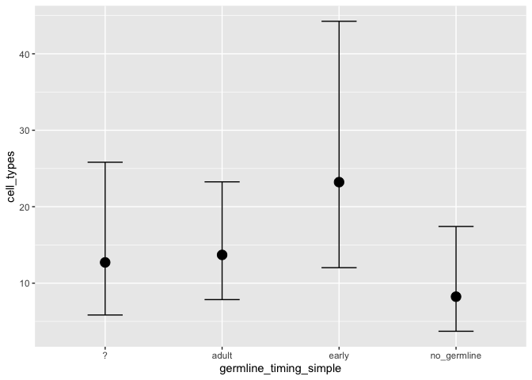<!-- -->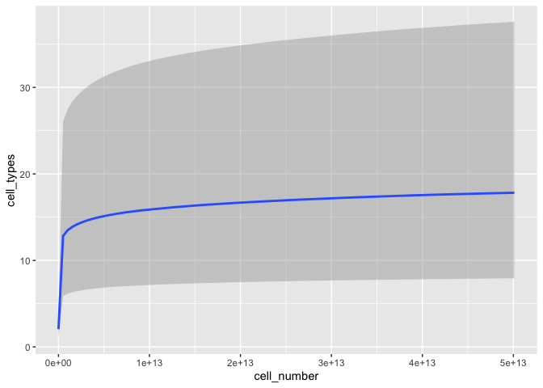<!-- -->

``` r
hyp = hypothesis(fit_type_phy,  c("germline_timing_simpleearly = germline_timing_simple", "germline_timing_simpleearly = germline_timing_simpleadult", "germline_timing_simpleearly = germline_timing_simpleno_germline"))
hyp
```

    ## Hypothesis Tests for class b:
    ##                 Hypothesis Estimate Est.Error CI.Lower CI.Upper Evid.Ratio
    ## 1 (germline_timing_... = 0     0.61      0.27     0.11     1.15         NA
    ## 2 (germline_timing_... = 0     0.53      0.21     0.13     0.93         NA
    ## 3 (germline_timing_... = 0     1.05      0.33     0.41     1.72         NA
    ##   Post.Prob Star
    ## 1        NA    *
    ## 2        NA    *
    ## 3        NA    *
    ## ---
    ## 'CI': 90%-CI for one-sided and 95%-CI for two-sided hypotheses.
    ## '*': For one-sided hypotheses, the posterior probability exceeds 95%;
    ## for two-sided hypotheses, the value tested against lies outside the 95%-CI.
    ## Posterior probabilities of point hypotheses assume equal prior probabilities.

``` r
plot(hyp)
```

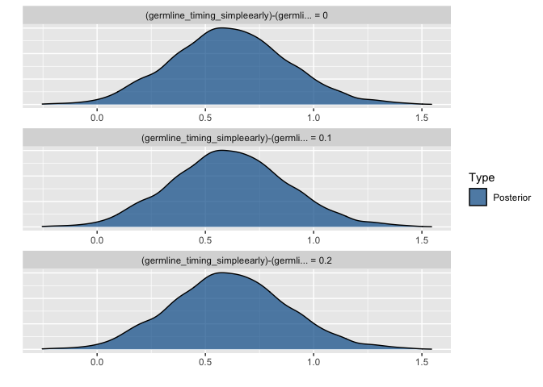<!-- -->
